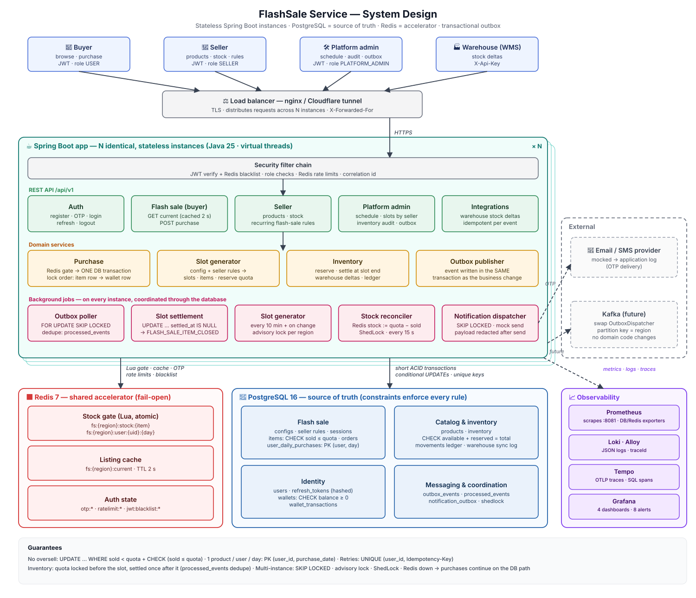

# FlashSale Service

Backend for **user authentication** and **time-slotted flash sales** with **inventory sync** —
Java 25, Spring Boot 4.1, PostgreSQL 16, Redis 7. Built to stay correct under concurrency and across multiple
instances.

| Requirement | Status |
|---|---|
| 2.1 Register / login / logout (email + phone, OTP) | ✅ |
| 2.2 Flash sale: many slots per day, DB-configured, no oversell, 1 product / user / day | ✅ |
| 2.3 Inventory sync: no duplicate processing, consistent data | ✅ |
| Security · ≥ 500 TPS · multi-instance · extensible · Docker | ✅ |
| Beyond the brief: seller / platform-admin APIs, recurring flash-sale rules, warehouse sync, observability (Grafana · Prometheus · Loki · Tempo), Redis-outage resilience | ✅ |



📐 **Architecture & design walkthrough:** [docs/PRESENTATION.md](docs/PRESENTATION.md) ·
**step-by-step API guide:** [docs/API-GUIDE.md](docs/API-GUIDE.md) ·
design notes: [docs/design-notes.md](docs/design-notes.md) ·
ADR (MVC + outbox vs Kafka): [docs/adr-001-mvc-outbox-kafka.md](docs/adr-001-mvc-outbox-kafka.md)

---

## Quick start (only Docker required)

```bash
cp .env.example .env              # optional — defaults work locally
docker compose up -d --build      # app + postgres + redis; schema + demo data are created automatically
open http://localhost:8080/swagger-ui.html
```

The Swagger page contains a step-by-step "try it" guide. Demo accounts (password `Secret123`):

| Role | Account | Can do |
|---|---|---|
| Buyer | `buyer0001@demo.flashsale.dev` … `buyer0200@demo.flashsale.dev` (balance 100,000,000 VND) | browse, purchase |
| Seller | `seller.vn@flashsale.dev` | products, stock, flash-sale rules |
| Platform admin | `admin.vn@flashsale.dev` | region schedule, slot overview, inventory audit, outbox |

Demo schedule: every day 24 × 1 h slots in VN, 3 products per slot (quota 5 / 20 / 100).

```bash
docker compose --profile scale up -d --build                             # 2 app instances behind nginx → :8088
RATE_LIMIT_LOGIN_IP=100000 docker compose --profile loadtest run --rm k6  # load + concurrency test
docker compose --profile tools up -d                                     # pgAdmin :5050, RedisInsight :5540
docker compose --profile observability up -d                             # Grafana :3000 (+ Prometheus, Loki, Tempo)
docker compose down            # stop            | docker compose down -v   # stop + wipe data
```

| URL | |
|---|---|
| http://localhost:8080/swagger-ui.html | API docs + try it |
| http://localhost:8081/actuator/health · `/actuator/prometheus` | Health · metrics (management port, localhost only) |
| http://localhost:3000 | Grafana: dashboards, logs, traces (`--profile observability`) |
| http://localhost:5050 · http://localhost:5540 | pgAdmin · RedisInsight (`--profile tools`, localhost only) |

OTP delivery is mocked — read the code from the log or from Redis (dev settings):
```bash
docker compose logs app | grep MOCK
docker compose exec redis redis-cli HGET otp:register:you@example.com code
```

---

## Main APIs

**Try every feature step by step:** [docs/API-GUIDE.md](docs/API-GUIDE.md) (copy-paste curl with expected results) ·
**Postman:** [collection](postman/FlashSale.postman_collection.json) + [environment](postman/FlashSale.local.postman_environment.json)
(39 requests with tests; run folder "0. Setup" first). Full, interactive reference: Swagger UI. Errors are RFC 7807 JSON with a stable `code` and a `correlationId`.

### Authentication — one API per function, email vs phone detected from `identifier`
| Method | Path | Auth | Body |
|---|---|---|---|
| POST | `/api/v1/auth/register` | – | `{identifier, password, region}` |
| POST | `/api/v1/auth/otp/verify` · `/otp/resend` | – | `{identifier, code}` · `{identifier}` |
| POST | `/api/v1/auth/login` | – | `{identifier, password}` → access + refresh token |
| POST | `/api/v1/auth/refresh` | – | `{refreshToken}` (rotation) |
| POST | `/api/v1/auth/logout` | Bearer | `{refreshToken}` optional |
| GET | `/api/v1/users/me` | Bearer | masked profile |

### Flash sale — buyers
| Method | Path | Auth | Notes |
|---|---|---|---|
| GET | `/api/v1/flash-sales/current?region=VN` | public | products on sale **now**; token's region wins if logged in |
| POST | `/api/v1/flash-sales/items/{itemId}/purchase` | buyer | header `Idempotency-Key`; 201 bought · 200 replay |

Errors: `404 FLASH_SALE_ITEM_NOT_FOUND` · `409 FLASH_SALE_NOT_ACTIVE / SOLD_OUT / ALREADY_PURCHASED_TODAY /
IDEMPOTENCY_KEY_REUSED` · `422 INSUFFICIENT_BALANCE` · `429 TOO_MANY_REQUESTS`.

### Sellers
| Method | Path | Purpose |
|---|---|---|
| POST · GET | `/api/v1/seller/products` | create product + stock · list own with stock |
| PATCH | `/api/v1/seller/products/{id}` | name / description / price / status (deactivate instead of delete) |
| POST | `/api/v1/seller/products/{id}/restock` | add stock (`Idempotency-Key`) |
| GET | `/api/v1/seller/flash-sales/config` | region windows (rule times must match) |
| POST · GET · PUT | `/api/v1/seller/flash-sales/rules[/{id}]` | recurring rule: product × start time × weekdays × price × quota |
| POST | `/api/v1/seller/flash-sales/rules/{id}/pause` · `/resume` · `/archive` | rule lifecycle |
| GET · POST | `/api/v1/seller/flash-sales/items?date=` · `/items/{id}/withdraw` | generated occurrences · skip one |

### Platform admin (own region)
| Method | Path | Purpose |
|---|---|---|
| GET · PUT | `/api/v1/admin/flash-sales/config` | schedule: enabled, window length, weekdays, horizon |
| GET | `/api/v1/admin/flash-sales/sessions?date=` | slots of a day, items grouped by seller |
| POST | `/api/v1/admin/flash-sales/generate` | run slot generation now |
| GET | `/api/v1/admin/inventory/audit` | stock vs. ledger per product + outbox lag |
| GET · POST | `/api/v1/admin/outbox?status=FAILED` · `/{id}/retry` | dead letters · re-queue |

### Integrations (API key `X-Api-Key`)
| Method | Path | Purpose |
|---|---|---|
| POST | `/api/v1/integrations/warehouse/stock-events` | warehouse stock deltas, idempotent per `(source, eventId)` |

---

## How the guarantees are met (short version — details in [docs/PRESENTATION.md](docs/PRESENTATION.md))

- **No oversell:** `UPDATE flash_sale_items SET sold = sold + 1 WHERE … sold < quota AND now() in slot` +
  `CHECK (sold <= quota)`. A Redis Lua gate rejects most losers first; the database has the final say.
- **1 product / user / day:** primary key `(user_id, purchase_date)` on `user_daily_purchases`.
- **Concurrency / retries:** one transaction per purchase (item row → wallet row, fixed lock order);
  `UNIQUE (user_id, idempotency_key)` on orders.
- **Inventory sync:** quota locked before the slot, settled once when it ends via a transactional outbox;
  `processed_events` dedupe + `CHECK (available + reserved = total)`.
- **Multi-instance:** stateless app; shared state in PostgreSQL / Redis; `SKIP LOCKED`, advisory locks, ShedLock.
- **Redis outage:** purchases continue on the database path; Redis-backed checks fail open (verified by stopping Redis).

Measured locally (k6, laptop): 200 concurrent buyers on a quota-5 item → exactly 5 orders (also with 2 instances);
500 req/s mixed load for 30 s → 0 errors, p95 ≈ 2–5 ms.

---

## Observability (Grafana · Prometheus · Loki · Tempo)

```bash
echo "TRACING_ENABLED=true" >> .env            # export traces to Tempo
docker compose --profile observability up -d   # then open http://localhost:3000 (anonymous viewer; admin/admin)
```

| Signal | Stack | What you get |
|---|---|---|
| **Metrics** | Micrometer → Prometheus (scrapes every instance on the internal management port 8081) + postgres/redis exporters | RED metrics per endpoint, DB pool, JVM, **business metrics** (purchases by result, Redis gate decisions, outbox backlog/lag, inventory drift, logins, OTP, rate limits, warehouse sync) |
| **Logs** | JSON logs → Grafana Alloy → Loki | every line carries `traceId` + `correlationId`; click a log line → its trace |
| **Traces** | Micrometer Tracing + OpenTelemetry (OTLP) → Tempo | HTTP → security → Redis Lua gate → each SQL statement (text only, never values); latency panels link to traces via exemplars |

Provisioned as code in [`docker/observability/`](docker/observability): 4 dashboards
(*Service overview*, *Flash sale live*, *Inventory, outbox & auth*, *Infrastructure*) and 8 alert rules
(5xx rate, p95 > 500 ms, outbox stuck / dead letters, **inventory drift**, Redis degraded, DB pool saturated,
instance down). Metrics are never exposed through the public port / tunnel. Details: [docs/PRESENTATION.md](docs/PRESENTATION.md#8-observability).

---

## Assumptions

**Users & auth**
1. Buyers self-register; sellers and platform admins are provisioned (seeded). **One role per account.**
2. `identifier` is an email or a phone number in **international format** (`+84…`, stored as E.164); one account per
   identifier across all regions. The user picks a **region** at registration; it cannot be changed by the user.
3. OTP delivery is **mocked** (DB outbox + log). Codes: 6 digits, 5 min, 5 attempts, single use. Unverified
   accounts cannot log in.
4. "Buyer already has a balance": every wallet is opened with a demo balance; there is no top-up or payment gateway.

**Flash sale**
5. **Markets (regions)**: every user, product and slot belongs to one region (VN / TH / SG). Timezone and currency
   come from app config; buyers can only buy in their own region. API times are UTC.
6. **"1 day" = the region-local calendar day of the slot's start** (a slot crossing midnight counts for its start day).
7. **"1 flash-sale product per user per day" = 1 unit of any flash-sale item**, across all slots and sellers of that
   day. Each purchase is **quantity 1**.
8. Default schedule: **every day, 24 × 1-hour windows**, 2 days generated ahead; the platform admin can change it
   per region. Changes apply to slots not generated yet.
9. Products belong to a seller. Sellers put **their own products** into slots with recurring rules (start time ×
   weekdays); nominations are **auto-approved** (config flag; review flow is schema-ready, no API yet).
10. The sale price must be lower than the product price; the order stores a price snapshot.
11. An order is **PAID immediately** (wallet debited in the same transaction). Cancellation, refund and shipping are
    out of scope.

**Inventory**
12. **Flash-sale quantity is committed before the slot** (reserved from stock when the occurrence is generated; if
    stock is short, that occurrence is skipped) and cannot change once the slot starts.
13. Inventory is **not touched during the slot**; it is settled once at slot end (sold units leave the stock, unsold
    return to sellable). `total` may therefore lag real sales by at most one slot; live sold counts are exact.
14. The external warehouse sends **stock deltas** (received / damaged / returned / correction), not absolute
    snapshots, and only affects sellable stock — never flash-sale reservations.
15. Products are **deactivated, not deleted** (orders and ledger keep their history).

**Platform**
16. PostgreSQL is the source of truth; Redis is an accelerator (gate, cache, OTP, rate limits, logout blacklist).
    **If Redis is down** the service stays up: listing, login and purchases keep working (purchases correct through
    the database alone), rate limiting and the logout blacklist **fail open** (a token logged out during the outage
    stays valid until it expires, ≤ 15 min), and OTP-dependent calls (register / verify) return `503` + `Retry-After`.
    The "Redis degraded" alert fires.
17. Rate-limit values and demo data are sized for a demo. Docker defaults (JWT/OTP secrets, OTP visible in logs and
    Redis) are **for local use only** — override them via `.env` anywhere else.

---

## Configuration

Everything is set through environment variables (see [.env.example](.env.example)); Docker Compose passes them to
the app. Most relevant: `JWT_SECRET`, `OTP_SECRET` (≥ 32 chars), `WAREHOUSE_API_KEY`, `SEED_ENABLED`,
`OTP_PLAIN_STORAGE` / `NOTIFICATION_MOCK_LOG_CONTENT` (dev only), `RATE_LIMIT_LOGIN_IP`, `FLASH_SALE_AUTO_APPROVE`.

### Public demo URL (Cloudflare Quick Tunnel)
```bash
# set random JWT_SECRET / OTP_SECRET in .env first — never expose the dev defaults
docker compose --profile tunnel up -d tunnel
docker compose logs tunnel | grep -o 'https://.*trycloudflare.com'
docker compose --profile tunnel stop tunnel
```
Only the API is exposed. Anyone with the URL can use the demo accounts — stop the tunnel after demoing.

## Run without Docker for the app (JDK 25)

```bash
docker compose up -d postgres redis
export JWT_SECRET=dev-only-jwt-secret-change-me-0123456789abcdef
export OTP_SECRET=dev-only-otp-secret-change-me-0123456789abcdef
./mvnw spring-boot:run
```

## Tests

```bash
./mvnw verify      # needs Docker (Testcontainers: PostgreSQL + Redis)
```
Integration tests cover the auth flow, rate limiting and notification outbox against real PostgreSQL/Redis.
Flash-sale concurrency and throughput are verified with the k6 script ([docker/k6/flash-sale.js](docker/k6/flash-sale.js)).

## Project layout

Feature modules, each layered the same way (`controller / dto / entity / repository / service / service/impl`,
plus `config / model / support / scheduler` where needed):

```
src/main/java/com/flashsale/
├── auth/          register / login / logout, OTP, JWT, refresh tokens
├── user/          users, wallets, /users/me
├── notification/  notification outbox + mock sender
├── region/        region config → timezone / currency
├── catalog/       products (seller)
├── inventory/     stock buckets + ledger, settlement consumer, warehouse sync, audit
├── flashsale/     schedule config, seller rules, slot generator, listing, purchase, Redis gate, settlement
├── order/         orders
├── outbox/        transactional outbox: publisher, poller (SKIP LOCKED), dispatcher (Kafka seam), admin
├── seed/          idempotent demo data
├── common/        errors, rate limiting, logging, security handlers, business metrics
└── config/        security, scheduling (ShedLock), OpenAPI
src/main/resources/db/migration/   Flyway V1–V5 (schema, constraints, seed config)
docker/                           nginx (scale), k6, pgAdmin / RedisInsight presets, observability stack
docs/                             presentation, design notes, ADR
```
