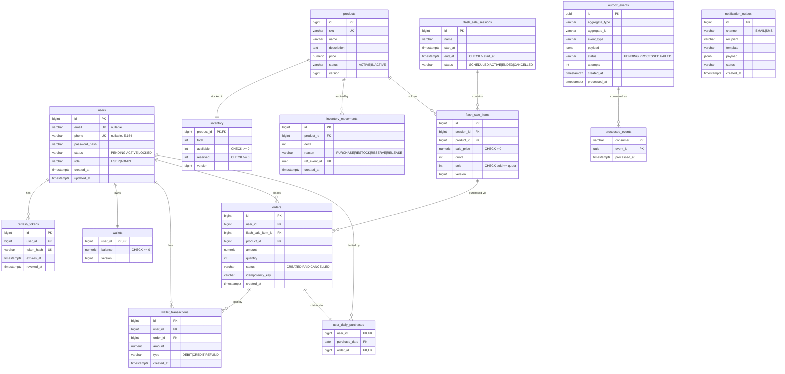

# 1. Requirement 
## High level
- User authentication 
- Flash sale
## Priorities
- Security 
- Fault tolerance 
- Stable in multi instances: race condition, concurrency
- Scalability
## Functional Requirement
- Authentication 
	- Register / log in / log out
	- Flash-sale
	- Sync-store - inventory

## Non-functional requirement 
- Security 
- Performance 
- Scalability
- Extensibility

# 2. Data Model
> Store: PostgreSQL = source of truth. Redis = ephemeral/shared state only (OTP, rate limit, access-token blacklist, flash-sale stock gate, cache).
> Timezone for "1 day" = `Asia/Ho_Chi_Minh` (assumption). Money = `numeric(19,2)`.

## 2.1 ERD (Mermaid)



## 2.2 ERD (ASCII)

```
                         ┌──────────────────────┐
                         │        users         │
                         │ PK id                │
                         │ UQ email / UQ phone  │
                         │ password_hash        │
                         │ status, role         │
                         └──────────┬───────────┘
     ┌──────────────┬───────────────┼──────────────────┬──────────────────────┐
     │1:N           │1:1            │1:N               │1:N                   │1:N
     ▼              ▼               ▼                  ▼                      ▼
┌──────────────┐ ┌──────────┐ ┌───────────────────┐ ┌──────────────────────┐ ┌───────────────────┐
│refresh_tokens│ │ wallets  │ │wallet_transactions│ │ user_daily_purchases │ │      orders       │
│ PK id        │ │ PK,FK    │ │ PK id             │ │ PK,FK user_id        │ │ PK id             │
│ FK user_id   │ │  user_id │ │ FK user_id        │ │ PK purchase_date     │ │ FK user_id        │
│ UQ token_hash│ │ balance  │ │ FK order_id ──────┼─┼──────────────────────┼▶│ FK flash_sale_    │
│ expires_at   │ │ version  │ │ amount, type      │ │ FK,UQ order_id ──────┼▶│    item_id        │
│ revoked_at   │ └──────────┘ └───────────────────┘ └──────────────────────┘ │ FK product_id     │
└──────────────┘                                                            │ amount, quantity  │
                                                                            │ status            │
                                                                            │ UQ(user_id,       │
                                                                            │  idempotency_key) │
                                                                            └────────┬──────────┘
                                                                                     │ N:1
┌─────────────────────┐ 1:N ┌──────────────────────────┐ N:1                         │
│ flash_sale_sessions │────▶│    flash_sale_items      │◀────────────────────────────┘
│ PK id               │     │ PK id                    │
│ name                │     │ FK session_id            │
│ start_at, end_at    │     │ FK product_id            │
│ status              │     │ sale_price, quota, sold  │
└─────────────────────┘     │ version                  │
                            │ UQ(session_id,product_id)│
                            └────────────┬─────────────┘
                                         │ N:1
                                         ▼
┌──────────────────────┐ 1:1 ┌────────────────────┐ 1:N ┌──────────────────────┐
│      inventory       │◀────│     products       │────▶│ inventory_movements  │
│ PK,FK product_id     │     │ PK id              │     │ PK id                │
│ total                │     │ UQ sku             │     │ FK product_id        │
│ available, reserved  │     │ name, description  │     │ delta, reason        │
│ version              │     │ price, status      │     │ UQ ref_event_id      │
└──────────────────────┘     │ version            │     └──────────────────────┘
                             └────────────────────┘

  Infrastructure (no FK):
  outbox_events ──(event_id)──▶ processed_events        notification_outbox
```

## 2.3 Relationships

| From | To | Cardinality | Meaning |
|---|---|---|---|
| users | refresh_tokens | 1:N | One user, many sessions/devices |
| users | wallets | 1:1 | Pre-seeded balance (assignment assumption) |
| users | wallet_transactions | 1:N | Balance ledger |
| users | orders | 1:N | Purchase history |
| users | user_daily_purchases | 1:N | One row per day the user bought |
| products | inventory | 1:1 | Stock of the product |
| products | inventory_movements | 1:N | Stock change ledger |
| products | flash_sale_items | 1:N | Product can appear in many sessions |
| flash_sale_sessions | flash_sale_items | 1:N | A time slot has a list of products |
| flash_sale_items | orders | 1:N | Orders placed against a sale item |
| orders | wallet_transactions | 1:N | Debit (+ refund later) |
| orders | user_daily_purchases | 1:1 | The order that consumed the daily slot |
| outbox_events | processed_events | 1:N | One row per consumer that handled the event |

## 2.4 Tables

### Auth / User

**users**
| Column | Type | Notes |
|---|---|---|
| id | bigint PK | |
| email | varchar(255) | UNIQUE, nullable, lower-cased |
| phone | varchar(20) | UNIQUE, nullable, E.164 |
| password_hash | varchar(100) | BCrypt/Argon2 |
| status | varchar(20) | `PENDING` → `ACTIVE` after OTP verify; `LOCKED` |
| role | varchar(20) | `USER`, `ADMIN` |
| created_at / updated_at | timestamptz | |

Constraint: `CHECK (email IS NOT NULL OR phone IS NOT NULL)`

**refresh_tokens**
| Column | Type | Notes |
|---|---|---|
| id | bigint PK | |
| user_id | bigint FK → users | idx |
| token_hash | varchar(64) | UNIQUE, SHA-256 of opaque token (never store raw) |
| expires_at | timestamptz | |
| revoked_at | timestamptz | set on logout / rotation |

**notification_outbox** — mocked OTP delivery
| Column | Type | Notes |
|---|---|---|
| id | bigint PK | |
| channel | varchar(10) | `EMAIL`, `SMS` |
| recipient | varchar(255) | |
| template | varchar(50) | e.g. `OTP_REGISTER` |
| payload | jsonb | |
| status | varchar(20) | `PENDING`, `SENT` |
| created_at | timestamptz | |

> OTP itself lives in Redis: `otp:{purpose}:{identifier}` → hash, TTL 5 min, attempt counter.

### Wallet

**wallets**
| Column | Type | Notes |
|---|---|---|
| user_id | bigint PK, FK → users | |
| balance | numeric(19,2) | `CHECK (balance >= 0)` |
| version | bigint | optimistic lock |

**wallet_transactions**
| Column | Type | Notes |
|---|---|---|
| id | bigint PK | |
| user_id | bigint FK → users | |
| order_id | bigint FK → orders | nullable (top-ups) |
| amount | numeric(19,2) | |
| type | varchar(20) | `DEBIT`, `CREDIT`, `REFUND` |
| created_at | timestamptz | |

### Catalog / Inventory

**products**
| Column | Type | Notes |
|---|---|---|
| id | bigint PK | |
| sku | varchar(64) | UNIQUE |
| name | varchar(255) | |
| description | text | |
| price | numeric(19,2) | regular price |
| status | varchar(20) | `ACTIVE`, `INACTIVE` |
| version | bigint | |

**inventory**
| Column | Type | Notes |
|---|---|---|
| product_id | bigint PK, FK → products | |
| total | int | physical stock |
| available | int | `CHECK (available >= 0)` — sellable outside flash sale |
| reserved | int | `CHECK (reserved >= 0)` — allocated to flash-sale quotas |
| version | bigint | optimistic lock |

**inventory_movements** — ledger + idempotency for sync
| Column | Type | Notes |
|---|---|---|
| id | bigint PK | |
| product_id | bigint FK → products | |
| delta | int | + / − |
| reason | varchar(20) | `PURCHASE`, `RESTOCK`, `RESERVE`, `RELEASE`, `ADJUST` |
| ref_event_id | uuid | UNIQUE → same event never applied twice |
| created_at | timestamptz | |

### Flash Sale

**flash_sale_sessions** — time slots, fully DB-configured
| Column | Type | Notes |
|---|---|---|
| id | bigint PK | |
| name | varchar(100) | e.g. "12:00 – 14:00" |
| start_at | timestamptz | idx(start_at, end_at) |
| end_at | timestamptz | `CHECK (end_at > start_at)` |
| status | varchar(20) | `SCHEDULED`, `ACTIVE`, `ENDED`, `CANCELLED` |

**flash_sale_items**
| Column | Type | Notes |
|---|---|---|
| id | bigint PK | |
| session_id | bigint FK → flash_sale_sessions | |
| product_id | bigint FK → products | |
| sale_price | numeric(19,2) | `CHECK (sale_price > 0)` |
| quota | int | `CHECK (quota >= 0)` |
| sold | int | **`CHECK (sold <= quota)`** — oversell impossible at DB level |
| version | bigint | |

Constraint: `UNIQUE (session_id, product_id)`

**orders**
| Column | Type | Notes |
|---|---|---|
| id | bigint PK | |
| user_id | bigint FK → users | idx(user_id, created_at) |
| flash_sale_item_id | bigint FK → flash_sale_items | |
| product_id | bigint FK → products | denormalized for queries |
| amount | numeric(19,2) | price snapshot |
| quantity | int | = 1 for flash sale |
| status | varchar(20) | `CREATED`, `PAID`, `CANCELLED` |
| idempotency_key | varchar(64) | `UNIQUE (user_id, idempotency_key)` |
| created_at | timestamptz | |

**user_daily_purchases** — enforces "1 flash-sale product / user / day"
| Column | Type | Notes |
|---|---|---|
| user_id | bigint FK → users | **PK (user_id, purchase_date)** |
| purchase_date | date | local date in `Asia/Ho_Chi_Minh` |
| order_id | bigint FK → orders | UNIQUE |

### Event / Sync (infrastructure)

**outbox_events** — written in same TX as business change
| Column | Type | Notes |
|---|---|---|
| id | uuid PK | |
| aggregate_type | varchar(50) | `ORDER`, `PRODUCT`, `INVENTORY` |
| aggregate_id | varchar(64) | |
| event_type | varchar(50) | `ORDER_CREATED`, `PRODUCT_STOCK_CHANGED`, ... |
| payload | jsonb | |
| status | varchar(20) | `PENDING`, `PROCESSED`, `FAILED` — idx(status, created_at) |
| attempts | int | retry count |
| created_at / processed_at | timestamptz | |

Polled with `SELECT ... FOR UPDATE SKIP LOCKED` → safe across instances.

**processed_events** — consumer-side dedupe
| Column | Type | Notes |
|---|---|---|
| consumer | varchar(50) | **PK (consumer, event_id)** |
| event_id | uuid | |
| processed_at | timestamptz | |

## 2.5 Correctness guaranteed at DB level

| Rule | Enforced by |
|---|---|
| No oversell | `UPDATE flash_sale_items SET sold = sold + 1 WHERE id = ? AND sold < quota` + `CHECK (sold <= quota)` |
| 1 product / user / day | PK `(user_id, purchase_date)` on `user_daily_purchases` |
| No negative balance | `UPDATE wallets ... WHERE balance >= ?` + `CHECK (balance >= 0)` |
| No duplicate purchase request | `UNIQUE (user_id, idempotency_key)` on `orders` |
| No duplicate stock sync | `processed_events` PK + `inventory_movements.ref_event_id` UNIQUE |
| Quota never exceeds stock | Creating a flash-sale item moves `quota` from `inventory.available` → `inventory.reserved` in one TX |

Redis (Lua stock gate + per-user-day key) = fast pre-filter for 500+ TPS only; DB constraints stay final truth.

## 2.6 Redis keys (not tables)

| Key | Value | TTL |
|---|---|---|
| `otp:{purpose}:{identifier}` | OTP hash + attempts | 5 min |
| `otp:cooldown:{identifier}` | flag | 60 s |
| `ratelimit:{scope}:{key}` | token bucket | window |
| `jwt:blacklist:{jti}` | 1 | until access token expiry |
| `fs:stock:{itemId}` | remaining quota | session end |
| `fs:user:{userId}:{date}` | itemId | end of day |
| `fs:current` | cached active items JSON | ~2–5 s |

## 2.7 Open questions

1. Timezone for "1 day" — `Asia/Ho_Chi_Minh` OK?
2. Quantity per purchase fixed at 1?
3. Sessions as absolute `timestamptz` rows (current pick; simple, explicit) vs recurring daily template (`start_time`, `end_time`, `valid_from/to`)? Template table can generate rows later.
4. Reserve flash-sale quota from inventory at config time (current pick) or deduct only on purchase?
