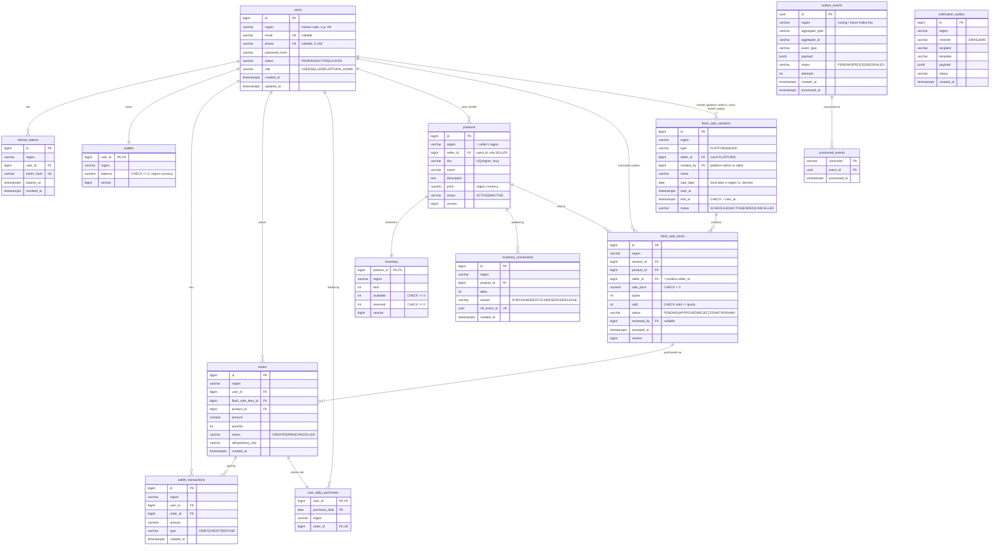

# 1. Requirement 
## High level
- User authentication 
- Flash sale
## Priorities
- Security 
- Fault tolerance 
- Stable in multi instances: race condition, concurrency
- Scalability
## Functional Requirement
- Authentication 
	- Register / log in / log out
	- Flash-sale
	- Sync-store - inventory

## Non-functional requirement 
- Security 
- Performance 
- Scalability
- Extensibility

# 2. Data Model
> Store: PostgreSQL = source of truth. Redis = ephemeral/shared state only (OTP, rate limit, access-token blacklist, flash-sale stock gate, cache).
> Timestamps stored in UTC (`timestamptz`). "1 day" = local date of the **region (market)** the flash sale runs in — see 2.0. Money = `numeric(19,2)`, currency implied by region.
> **No `regions` table** — `region` is a column on every business table; region metadata (timezone, currency) comes from app config — see 2.0.1.

## 2.0 Decision: timezone / "1 day" = region timezone (Option C)

| Option | "1 day" means | Verdict |
|---|---|---|
| A. Global UTC | UTC date | ❌ VN day resets at 07:00 — bad UX |
| B. Per-user timezone | Local date of each user | ❌ Abusable: user switches tz → extra purchase; inconsistent day boundaries |
| **C. Region/market timezone** | Local date of the region the sale runs in | ✅ Chosen |

Rules:
1. All timestamps stored in UTC (`timestamptz`); `start_at`/`end_at` are absolute instants.
2. Timezone resolved server-side from the row's `region` via region config — never from client header/body/device.
3. `purchase_date` = `flash_sale_sessions.sale_date` (session's local date in region tz, derived on save) — not `now()`. Deterministic; a session crossing midnight (23:00→01:00) counts as its start date.
4. User belongs to exactly one region (set at register; change via platform admin only).
5. **Single source of timezone = region config.** No timezone column in any table. Any local time needed (business rule or display) = `row.region → config → timezone`. API returns ISO-8601 UTC + `region`; client renders local.
6. Purchase requires `user.region = flash_sale_item.region` — enforced by composite FK (see 2.0.2).
7. Future multi-market buying → change `user_daily_purchases` PK to `(user_id, region, purchase_date)`.

### 2.0.1 Region as a column (no `regions` table)

- Every business table has `region varchar(8) NOT NULL` — market code, e.g. `VN`, `TH`. `CHECK (region ~ '^[A-Z]{2,8}$')`.
- Region metadata lives in **app config** (`application.yml`, env-overridable), loaded at startup into a `RegionRegistry`; request/data with unknown region → rejected.
  ```yaml
  app:
    regions:
      VN: { timezone: Asia/Ho_Chi_Minh, currency: VND }
      TH: { timezone: Asia/Bangkok,     currency: THB }
  ```
- Flash-sale config (sessions, items, quotas, prices) **still lives in DB** (assignment §2.2); only static market metadata is in config.

| Pros | Cons / mitigation |
|---|---|
| No join to know a row's market; every row self-describing | No FK validates the code → `CHECK` format + `RegionRegistry` validation on write |
| `WHERE region = ?` on every query; indexes lead with `region` | Adding a market / changing tz = config change + redeploy (rare) |
| Natural **partition / shard key** later (Postgres LIST partitioning, DB-per-region) | Column repeated on every table (tiny: 2–8 bytes) |
| Natural **Kafka partition key** / routing key for outbox events | Must keep parent/child region consistent → composite FKs (2.0.2) |

### 2.0.2 Region consistency via composite FKs

Parent tables expose `UNIQUE (id, region)`; children reference `(parent_id, region)`. The DB then guarantees related rows share one region:

```sql
ALTER TABLE users               ADD CONSTRAINT uq_users_id_region    UNIQUE (id, region);
ALTER TABLE products            ADD CONSTRAINT fk_product_seller
      FOREIGN KEY (seller_id, region)  REFERENCES users (id, region);
ALTER TABLE products            ADD CONSTRAINT uq_products_id_seller_region UNIQUE (id, seller_id, region);
ALTER TABLE flash_sale_items    ADD CONSTRAINT fk_item_product_owner       -- seller can only nominate OWN product
      FOREIGN KEY (product_id, seller_id, region) REFERENCES products (id, seller_id, region);
ALTER TABLE flash_sale_items    ADD CONSTRAINT fk_item_session
      FOREIGN KEY (session_id, region) REFERENCES flash_sale_sessions (id, region);
ALTER TABLE orders              ADD CONSTRAINT fk_order_user
      FOREIGN KEY (user_id, region)    REFERENCES users (id, region);
ALTER TABLE orders              ADD CONSTRAINT fk_order_item
      FOREIGN KEY (flash_sale_item_id, region) REFERENCES flash_sale_items (id, region);
-- → an order can only exist if buyer.region = item.region = session.region = product.region = seller.region
```

### 2.0.3 Roles & ownership (Shopee-style marketplace)

| Role | Who | Can do |
|---|---|---|
| `USER` | Buyer | Browse current flash sale of own region, purchase |
| `SELLER` | Shop owner | CRUD **own** products + inventory; nominate **own** products into flash-sale slots; edit/withdraw **own** items before slot starts |
| `PLATFORM_ADMIN` | Platform operator | Create/manage flash-sale slots (sessions) of own region; view all nominations grouped by seller; approve/reject (auto for now) |

All three are rows in `users` (`role` column, no separate tables); every user has a `region`. **One role per account** — a seller or platform admin cannot purchase (purchase API requires `ROLE_USER`).

**Ownership rules**
- Product belongs to exactly one seller: `products.seller_id`. Product region = seller region → composite FK `(seller_id, region) → users(id, region)`.
- **Owner-only edits**: seller can update only products where `seller_id = current user` (app layer, 403 otherwise). No sharing between sellers of the same region.
- Flash-sale item belongs to the seller who nominated it: `flash_sale_items.seller_id`. Composite FK `(product_id, seller_id, region) → products(id, seller_id, region)` ⇒ **DB guarantees a seller can only put their own product** in a flash sale.
- Region chain: `seller.region = product.region = inventory.region = item.region = session.region = order.region = buyer.region`.
- Role checks (`seller_id` really is a `SELLER`, `created_by` is a `PLATFORM_ADMIN`) = app layer (service + `ROLE_*`). Optional DB hardening via `UNIQUE (id, region, role)` + role column in FK — skipped (extra columns, blocks role changes).

### 2.0.4 Flash sale types & flow

| Type | Slot created by | Items from | Shown | Status |
|---|---|---|---|---|
| **`PLATFORM`** (Shopee Flash Sale) | `PLATFORM_ADMIN` | Many sellers nominate own products | Flash-sale page of the region, all sellers merged | ✅ **Build now** |
| `SHOP` (Shop Flash Sale) | `SELLER` | That seller only | Seller's shop page | 🔜 Schema-ready only (`type`, `seller_id` on sessions), no API yet |

Flow (type `PLATFORM`):
1. Platform admin creates slot: region, start/end (e.g. VN 12:00–14:00).
2. Seller nominates own product: sale price, quota → `flash_sale_items(status = APPROVED)` — **auto-approve** (`app.flash-sale.auto-approve=true`). Quota reserved from inventory in same TX.
3. Buyer lists current flash sale → only `APPROVED` items of active sessions in buyer's region, all sellers merged.
4. Seller can edit/withdraw own item only before slot starts (`WITHDRAWN` releases reserved quota).
5. Platform admin lists items of a slot grouped by seller (idx `(session_id, seller_id)`).

Approval flow later = set flag `false` → items start `PENDING`, platform admin approves/rejects; columns `reviewed_by`, `reviewed_at` already exist.

**1 flash-sale product / buyer / day** stays platform-wide (all sellers, all slots of the region-day).

## 2.1 ERD (Mermaid)


```mermaid
erDiagram
    users ||--o{ refresh_tokens : "has"
    users ||--|| wallets : "owns"
    users ||--o{ wallet_transactions : "has"
    users ||--o{ orders : "places"
    users ||--o{ user_daily_purchases : "limited by"
    users ||--o{ products : "owns (seller)"
    users ||--o{ flash_sale_items : "nominates (seller)"
    users ||--o{ flash_sale_sessions : "creates (platform admin) / owns SHOP (seller)"

    products ||--|| inventory : "stocked in"
    products ||--o{ inventory_movements : "audited by"
    products ||--o{ flash_sale_items : "sold as"

    flash_sale_sessions ||--o{ flash_sale_items : "contains"
    flash_sale_items ||--o{ orders : "purchased via"

    orders ||--o{ wallet_transactions : "paid by"
    orders ||--|| user_daily_purchases : "claims slot"

    outbox_events ||--o{ processed_events : "consumed as"

    users {
        bigint id PK
        varchar region "market code, e.g. VN"
        varchar email UK "nullable"
        varchar phone UK "nullable, E.164"
        varchar password_hash
        varchar status "PENDING|ACTIVE|LOCKED"
        varchar role "USER|SELLER|PLATFORM_ADMIN"
        timestamptz created_at
        timestamptz updated_at
    }
    refresh_tokens {
        bigint id PK
        varchar region
        bigint user_id FK
        varchar token_hash UK
        timestamptz expires_at
        timestamptz revoked_at
    }
    wallets {
        bigint user_id PK, FK
        varchar region
        numeric balance "CHECK >= 0, region currency"
        bigint version
    }
    wallet_transactions {
        bigint id PK
        varchar region
        bigint user_id FK
        bigint order_id FK
        numeric amount
        varchar type "DEBIT|CREDIT|REFUND"
        timestamptz created_at
    }
    products {
        bigint id PK
        varchar region "= seller's region"
        bigint seller_id FK "users.id, role SELLER"
        varchar sku "UQ(region, sku)"
        varchar name
        text description
        numeric price "region currency"
        varchar status "ACTIVE|INACTIVE"
        bigint version
    }
    inventory {
        bigint product_id PK, FK
        varchar region
        int total
        int available "CHECK >= 0"
        int reserved "CHECK >= 0"
        bigint version
    }
    inventory_movements {
        bigint id PK
        varchar region
        bigint product_id FK
        int delta
        varchar reason "PURCHASE|RESTOCK|RESERVE|RELEASE"
        uuid ref_event_id UK
        timestamptz created_at
    }
    flash_sale_sessions {
        bigint id PK
        varchar region
        varchar type "PLATFORM|SHOP"
        bigint seller_id FK "null if PLATFORM"
        bigint created_by FK "platform admin or seller"
        varchar name
        date sale_date "local date in region tz, derived"
        timestamptz start_at
        timestamptz end_at "CHECK > start_at"
        varchar status "SCHEDULED|ACTIVE|ENDED|CANCELLED"
    }
    flash_sale_items {
        bigint id PK
        varchar region
        bigint session_id FK
        bigint product_id FK
        bigint seller_id FK "= product.seller_id"
        numeric sale_price "CHECK > 0"
        int quota
        int sold "CHECK sold <= quota"
        varchar status "PENDING|APPROVED|REJECTED|WITHDRAWN"
        bigint reviewed_by FK "nullable"
        timestamptz reviewed_at
        bigint version
    }
    orders {
        bigint id PK
        varchar region
        bigint user_id FK
        bigint flash_sale_item_id FK
        bigint product_id FK
        numeric amount
        int quantity
        varchar status "CREATED|PAID|CANCELLED"
        varchar idempotency_key
        timestamptz created_at
    }
    user_daily_purchases {
        bigint user_id PK, FK
        date purchase_date PK
        varchar region
        bigint order_id FK, UK
    }
    outbox_events {
        uuid id PK
        varchar region "routing / future Kafka key"
        varchar aggregate_type
        varchar aggregate_id
        varchar event_type
        jsonb payload
        varchar status "PENDING|PROCESSED|FAILED"
        int attempts
        timestamptz created_at
        timestamptz processed_at
    }
    processed_events {
        varchar consumer PK
        uuid event_id PK
        timestamptz processed_at
    }
    notification_outbox {
        bigint id PK
        varchar region
        varchar channel "EMAIL|SMS"
        varchar recipient
        varchar template
        jsonb payload
        varchar status
        timestamptz created_at
    }
```

## 2.2 ERD (ASCII)

```
                         ┌──────────────────────┐
                         │        users         │
                         │ PK id                │
                         │ region               │
                         │ UQ email / UQ phone  │
                         │ password_hash        │
                         │ status, role         │
                         └──────────┬───────────┘
     ┌──────────────┬───────────────┼──────────────────┬──────────────────────┐
     │1:N           │1:1            │1:N               │1:N                   │1:N
     ▼              ▼               ▼                  ▼                      ▼
┌──────────────┐ ┌──────────┐ ┌───────────────────┐ ┌──────────────────────┐ ┌───────────────────┐
│refresh_tokens│ │ wallets  │ │wallet_transactions│ │ user_daily_purchases │ │      orders       │
│ PK id        │ │ PK,FK    │ │ PK id             │ │ PK,FK user_id        │ │ PK id             │
│ region       │ │  user_id │ │ region            │ │ PK purchase_date     │ │ region            │
│ FK user_id   │ │ region   │ │ FK user_id        │ │ region               │ │ FK user_id        │
│ UQ token_hash│ │ balance  │ │ FK order_id ──────┼─┼──────────────────────┼▶│ FK flash_sale_    │
│ expires_at   │ │ version  │ │ amount, type      │ │ FK,UQ order_id ──────┼▶│    item_id        │
│ revoked_at   │ └──────────┘ └───────────────────┘ └──────────────────────┘ │ FK product_id     │
└──────────────┘                                                            │ amount, quantity  │
                                                                            │ status            │
                                                                            │ UQ(user_id,       │
                                                                            │  idempotency_key) │
                                                                            └────────┬──────────┘
                                                                                     │ N:1
┌─────────────────────┐ 1:N ┌──────────────────────────┐ N:1                         │
│ flash_sale_sessions │────▶│    flash_sale_items      │◀────────────────────────────┘
│ PK id               │     │ PK id                    │
│ region              │     │ region                   │
│ type PLATFORM|SHOP  │     │ FK session_id            │
│ FK seller_id (SHOP) │     │ FK product_id            │
│ FK created_by       │     │ FK seller_id (owner)     │
│ name, sale_date     │     │ sale_price, quota, sold  │
│ start_at, end_at    │     │ status (auto APPROVED)   │
│ status              │     │ version                  │
└─────────────────────┘     │ UQ(session_id,product_id)│
                            └────────────┬─────────────┘
                                         │ N:1
                                         ▼
┌──────────────────────┐ 1:1 ┌────────────────────┐ 1:N ┌──────────────────────┐
│      inventory       │◀────│     products       │────▶│ inventory_movements  │
│ PK,FK product_id     │     │ PK id              │     │ PK id                │
│ region               │     │ region             │     │ region               │
│                      │     │ FK seller_id       │     │                      │
│ total                │     │ UQ(region, sku)    │     │ FK product_id        │
│ available, reserved  │     │ name, description  │     │ delta, reason        │
│ version              │     │ price, status      │     │ UQ ref_event_id      │
└──────────────────────┘     │ version            │     └──────────────────────┘
                             └────────────────────┘

  products.seller_id          ──N:1──▶ users (role SELLER, same region)
  flash_sale_items.seller_id  ──N:1──▶ users (role SELLER) — FK (product_id, seller_id, region) → products
  flash_sale_sessions.created_by ─N:1▶ users (role PLATFORM_ADMIN; SELLER for future SHOP type)

  Infrastructure (no FK):
  outbox_events (region) ──(event_id)──▶ processed_events        notification_outbox (region)

  Every FK between business tables is composite (child_fk, region) → parent(id, region),
  so parent and child are always in the same region (see 2.0.2).
```

## 2.3 Relationships

All FKs below are composite `(fk, region) → parent(id, region)` (see 2.0.2).

| From | To | Cardinality | Meaning |
|---|---|---|---|
| users | refresh_tokens | 1:N | One user, many sessions/devices |
| users | wallets | 1:1 | Pre-seeded balance (assignment assumption) |
| users | wallet_transactions | 1:N | Balance ledger |
| users | orders | 1:N | Purchase history |
| users | user_daily_purchases | 1:N | One row per day the user bought |
| users (seller) | products | 1:N | Seller owns products; product region = seller region |
| users (seller) | flash_sale_items | 1:N | Seller nominates own products into slots |
| users (platform admin) | flash_sale_sessions | 1:N | Platform admin creates `PLATFORM` slots (`created_by`) |
| users (seller) | flash_sale_sessions | 1:N | Future `SHOP` sessions (`seller_id`), schema-ready only |
| products | inventory | 1:1 | Stock of the product |
| products | inventory_movements | 1:N | Stock change ledger |
| products | flash_sale_items | 1:N | Product can appear in many sessions |
| flash_sale_sessions | flash_sale_items | 1:N | A time slot has a list of products |
| flash_sale_items | orders | 1:N | Orders placed against a sale item |
| orders | wallet_transactions | 1:N | Debit (+ refund later) |
| orders | user_daily_purchases | 1:1 | The order that consumed the daily slot |
| outbox_events | processed_events | 1:N | One row per consumer that handled the event |

## 2.4 Tables

> Every table below has `region varchar(8) NOT NULL` + `CHECK (region ~ '^[A-Z]{2,8}$')` — shown as the 2nd column.
> Exception: `processed_events` (pure dedupe on `event_id`) and `shedlock` (infra) — region adds nothing there.

### Auth / User

**users**
| Column | Type | Notes |
|---|---|---|
| id | bigint PK | `UNIQUE (id, region)` — target for composite FKs |
| region | varchar(8) | home market; set at register; not user-editable |
| email | varchar(255) | UNIQUE (global — one account per email), nullable, lower-cased |
| phone | varchar(20) | UNIQUE (global), nullable, E.164 |
| password_hash | varchar(100) | BCrypt/Argon2 |
| status | varchar(20) | `PENDING` → `ACTIVE` after OTP verify; `LOCKED` |
| role | varchar(20) | `USER` (buyer), `SELLER`, `PLATFORM_ADMIN` |
| created_at / updated_at | timestamptz | |

Constraint: `CHECK (email IS NOT NULL OR phone IS NOT NULL)`

**refresh_tokens**
| Column | Type | Notes |
|---|---|---|
| id | bigint PK | |
| region | varchar(8) | |
| user_id | bigint | FK `(user_id, region)` → users; idx |
| token_hash | varchar(64) | UNIQUE, SHA-256 of opaque token (never store raw) |
| expires_at | timestamptz | |
| revoked_at | timestamptz | set on logout / rotation |

**notification_outbox** — mocked OTP delivery
| Column | Type | Notes |
|---|---|---|
| id | bigint PK | |
| region | varchar(8) | picks locale / SMS provider per market |
| channel | varchar(10) | `EMAIL`, `SMS` |
| recipient | varchar(255) | |
| template | varchar(50) | e.g. `OTP_REGISTER` |
| payload | jsonb | |
| status | varchar(20) | `PENDING`, `SENT` |
| created_at | timestamptz | |

> OTP itself lives in Redis: `otp:{purpose}:{identifier}` → hash, TTL 5 min, attempt counter.

### Wallet

**wallets**
| Column | Type | Notes |
|---|---|---|
| user_id | bigint PK | FK `(user_id, region)` → users |
| region | varchar(8) | currency = region currency |
| balance | numeric(19,2) | `CHECK (balance >= 0)` |
| version | bigint | optimistic lock |

**wallet_transactions**
| Column | Type | Notes |
|---|---|---|
| id | bigint PK | |
| region | varchar(8) | |
| user_id | bigint | FK `(user_id, region)` → users |
| order_id | bigint | FK `(order_id, region)` → orders; nullable (top-ups) |
| amount | numeric(19,2) | |
| type | varchar(20) | `DEBIT`, `CREDIT`, `REFUND` |
| created_at | timestamptz | |

### Catalog / Inventory

**products**
| Column | Type | Notes |
|---|---|---|
| id | bigint PK | `UNIQUE (id, region)` |
| region | varchar(8) | = owning seller's region (composite FK) |
| seller_id | bigint | FK `(seller_id, region)` → users; owner, `role = SELLER` (app check); idx(seller_id). `UNIQUE (id, seller_id, region)` → target for items FK |
| sku | varchar(64) | `UNIQUE (region, sku)` |
| name | varchar(255) | |
| description | text | |
| price | numeric(19,2) | regular price, region currency |
| status | varchar(20) | `ACTIVE`, `INACTIVE` |
| version | bigint | |

**inventory**
| Column | Type | Notes |
|---|---|---|
| product_id | bigint PK | FK `(product_id, region)` → products |
| region | varchar(8) | |
| total | int | physical stock |
| available | int | `CHECK (available >= 0)` — sellable outside flash sale |
| reserved | int | `CHECK (reserved >= 0)` — allocated to flash-sale quotas |
| version | bigint | optimistic lock |

**inventory_movements** — ledger + idempotency for sync
| Column | Type | Notes |
|---|---|---|
| id | bigint PK | |
| region | varchar(8) | |
| product_id | bigint | FK `(product_id, region)` → products |
| delta | int | + / − |
| reason | varchar(20) | `PURCHASE`, `RESTOCK`, `RESERVE`, `RELEASE`, `ADJUST` |
| ref_event_id | uuid | UNIQUE → same event never applied twice |
| created_at | timestamptz | |

### Flash Sale

**flash_sale_sessions** — time slots, fully DB-configured
| Column | Type | Notes |
|---|---|---|
| id | bigint PK | `UNIQUE (id, region)` |
| region | varchar(8) | market the session runs in; idx(region, start_at, end_at) |
| type | varchar(10) | `PLATFORM` (build now), `SHOP` (future) |
| seller_id | bigint | nullable; FK `(seller_id, region)` → users. `CHECK ((type = 'PLATFORM' AND seller_id IS NULL) OR (type = 'SHOP' AND seller_id IS NOT NULL))` |
| created_by | bigint | FK `(created_by, region)` → users; platform admin (or seller for `SHOP`) |
| name | varchar(100) | e.g. "12:00 – 14:00" |
| sale_date | date | local date of `start_at` in region tz, computed on save |
| start_at | timestamptz | UTC instant |
| end_at | timestamptz | `CHECK (end_at > start_at)` |
| status | varchar(20) | `SCHEDULED`, `ACTIVE`, `ENDED`, `CANCELLED` |

**flash_sale_items**
| Column | Type | Notes |
|---|---|---|
| id | bigint PK | `UNIQUE (id, region)` |
| region | varchar(8) | |
| session_id | bigint | FK `(session_id, region)` → flash_sale_sessions |
| product_id | bigint | FK `(product_id, seller_id, region)` → products(id, seller_id, region) |
| seller_id | bigint | owner (nominating seller); = product's seller (enforced by FK above); idx(session_id, seller_id) |
| sale_price | numeric(19,2) | `CHECK (sale_price > 0)` |
| quota | int | `CHECK (quota >= 0)` |
| sold | int | **`CHECK (sold <= quota)`** — oversell impossible at DB level |
| status | varchar(20) | `PENDING`, `APPROVED`, `REJECTED`, `WITHDRAWN`; auto-approve → inserted as `APPROVED` |
| reviewed_by | bigint | nullable; FK `(reviewed_by, region)` → users (platform admin) |
| reviewed_at | timestamptz | nullable |
| version | bigint | |

Constraint: `UNIQUE (session_id, product_id)`

**orders**
| Column | Type | Notes |
|---|---|---|
| id | bigint PK | `UNIQUE (id, region)` |
| region | varchar(8) | idx(region, created_at) |
| user_id | bigint | FK `(user_id, region)` → users; idx(user_id, created_at) |
| flash_sale_item_id | bigint | FK `(flash_sale_item_id, region)` → flash_sale_items |
| product_id | bigint | FK `(product_id, region)` → products; denormalized for queries |
| amount | numeric(19,2) | price snapshot, region currency |
| quantity | int | = 1 for flash sale |
| status | varchar(20) | `CREATED`, `PAID`, `CANCELLED` |
| idempotency_key | varchar(64) | `UNIQUE (user_id, idempotency_key)` |
| created_at | timestamptz | |

**user_daily_purchases** — enforces "1 flash-sale product / user / day"
| Column | Type | Notes |
|---|---|---|
| user_id | bigint | **PK (user_id, purchase_date)**; FK `(user_id, region)` → users |
| purchase_date | date | = `flash_sale_sessions.sale_date` (region-local day) |
| region | varchar(8) | |
| order_id | bigint | UNIQUE; FK `(order_id, region)` → orders |

### Event / Sync (infrastructure)

**outbox_events** — written in same TX as business change
| Column | Type | Notes |
|---|---|---|
| id | uuid PK | |
| region | varchar(8) | routing key; future Kafka partition key |
| aggregate_type | varchar(50) | `ORDER`, `PRODUCT`, `INVENTORY` |
| aggregate_id | varchar(64) | |
| event_type | varchar(50) | `ORDER_CREATED`, `PRODUCT_STOCK_CHANGED`, ... |
| payload | jsonb | |
| status | varchar(20) | `PENDING`, `PROCESSED`, `FAILED` — idx(status, created_at) |
| attempts | int | retry count |
| created_at / processed_at | timestamptz | |

Polled with `SELECT ... FOR UPDATE SKIP LOCKED` → safe across instances.

**processed_events** — consumer-side dedupe (no `region`: keyed by event id only)
| Column | Type | Notes |
|---|---|---|
| consumer | varchar(50) | **PK (consumer, event_id)** |
| event_id | uuid | |
| processed_at | timestamptz | |

## 2.5 Correctness guaranteed at DB level

| Rule | Enforced by |
|---|---|
| No oversell | `UPDATE flash_sale_items SET sold = sold + 1 WHERE id = ? AND status = 'APPROVED' AND sold < quota` + `CHECK (sold <= quota)` |
| 1 product / user / day | PK `(user_id, purchase_date)` on `user_daily_purchases`; `purchase_date` = session's region-local `sale_date` |
| Buy only in own market | Composite FKs `orders(user_id, region)` + `orders(flash_sale_item_id, region)` → user and item must share region (app `RegionMatchRule` gives a clean 403 first) |
| Item / session / product in same market | Composite FKs on `flash_sale_items` |
| Product in its seller's market | Composite FK `products(seller_id, region)` → `users(id, region)` |
| Seller nominates only own product | Composite FK `flash_sale_items(product_id, seller_id, region)` → `products(id, seller_id, region)` |
| Buyer sees/buys only approved items | Purchase `UPDATE ... WHERE status = 'APPROVED'` + session time window |
| No negative balance | `UPDATE wallets ... WHERE balance >= ?` + `CHECK (balance >= 0)` |
| No duplicate purchase request | `UNIQUE (user_id, idempotency_key)` on `orders` |
| No duplicate stock sync | `processed_events` PK + `inventory_movements.ref_event_id` UNIQUE |
| Quota never exceeds stock | Creating a flash-sale item moves `quota` from `inventory.available` → `inventory.reserved` in one TX |

Redis (Lua stock gate + per-user-day key) = fast pre-filter for 500+ TPS only; DB constraints stay final truth.

## 2.6 Redis keys (not tables)

| Key | Value | TTL |
|---|---|---|
| `otp:{purpose}:{identifier}` | OTP hash + attempts | 5 min |
| `otp:cooldown:{identifier}` | flag | 60 s |
| `ratelimit:{scope}:{key}` | token bucket | window |
| `jwt:blacklist:{jti}` | 1 | until access token expiry |
| `fs:{region}:stock:{itemId}` | remaining quota | session end |
| `fs:{region}:user:{userId}:{saleDate}` | itemId | end of region-local day |
| `fs:{region}:current` | cached active items JSON | ~2–5 s |

`{region}` in braces = Redis Cluster hash tag → all keys of one market on the same slot (Lua script can touch them atomically).

## 2.7 Open questions

1. ~~Timezone for "1 day"~~ → **Decided: region timezone (Option C), see 2.0.**
2. ~~Quantity per purchase~~ → **Decided: always 1** (req 2.2 "1 sản phẩm / ngày"); `CHECK (quantity = 1)`, no quantity in API.
3. ~~Session rows vs daily template~~ → **Decided: one row per slot per day** (each slot has own items/quota/price). Template + generator job = later extension.
4. ~~Reserve quota upfront vs deduct on purchase~~ → **Decided: reserve at nomination** (`available → reserved`), so configured quota is always backed by stock.
5. ~~`regions` table~~ → **Decided: `region` column on every table, metadata in app config, see 2.0.1.**
6. ~~Products per region vs global~~ → **Decided: product belongs to a seller, seller belongs to a region (2.0.3).**
7. ~~Edit rights on products~~ → **Decided: owner-only — seller edits only own products.**
8. ~~Who owns flash-sale sessions~~ → **Decided: Shopee-style — platform admin creates slots, sellers nominate own products, auto-approve; `SHOP` type schema-ready only (2.0.4).**
9. ~~One account both buyer and seller?~~ → **Decided: no — one role per account (simple for now).** Seller/platform admin cannot buy; later → `user_roles` join table if needed.

## 2.8 Requirement 2.2 coverage

| Requirement | Covered by |
|---|---|
| Many time slots per day | `flash_sale_sessions` (`start_at`, `end_at`, `sale_date`) — N rows per region per day |
| Slot has product list | `flash_sale_items.session_id` |
| Slot has quota | `flash_sale_items.quota` / `sold` |
| Slot has sale price (amount) | `flash_sale_items.sale_price` (API field `amount`) |
| Config in DB, not hard-coded | Sessions/items are DB rows (platform/seller APIs + Flyway seed). Only region tz/currency in app config |
| API: products on sale now | `GET /api/v1/flash-sales/current` — `APPROVED` items, `now() BETWEEN start_at AND end_at`, buyer's region |
| API: buy only in valid slot | `POST /api/v1/flash-sales/items/{id}/purchase` — window check inside atomic `UPDATE` |
| Buyer already has balance | `wallets` (opened with `app.wallet.initial-balance` at register) |
| No oversell | `UPDATE … WHERE sold < quota` + `CHECK (sold <= quota)` |
| 1 product / user / day | PK `(user_id, purchase_date)` on `user_daily_purchases` |
| Correct under concurrency | Atomic conditional updates + constraints in one TX; Redis Lua pre-filter |

Scope note: seller/platform layer is our extension — buyer flow first; seller/platform APIs thin; seed data lets reviewers test buyer flow without admin APIs.

## 2.9 Authentication API (implemented)

One endpoint per function; email vs phone decided from `identifier` (contains `@` → email, else phone in international format `+84…`, stored E.164).

| Method | Path | Auth | Body | Success | Notes |
|---|---|---|---|---|---|
| POST | `/api/v1/auth/register` | public | `{identifier, password, region}` | 202 generic message | Creates `PENDING` buyer + wallet + OTP in one TX. Existing identifier → same 202 (PENDING gets fresh OTP, ACTIVE ignored) |
| POST | `/api/v1/auth/otp/verify` | public | `{identifier, code}` | 200 | Single-use, 5 min TTL, 5 attempts then invalidated → `ACTIVE` |
| POST | `/api/v1/auth/otp/resend` | public | `{identifier}` | 202 generic message | 60 s cooldown per identifier |
| POST | `/api/v1/auth/login` | public | `{identifier, password}` | 200 `{accessToken, tokenType, expiresIn, refreshToken, refreshExpiresIn}` | Unknown user / wrong password → same 401 (+ dummy BCrypt for equal timing). `ACCOUNT_NOT_VERIFIED` only after correct password |
| POST | `/api/v1/auth/refresh` | public | `{refreshToken}` | 200 new pair | Rotation; reuse of a rotated token → all sessions of user revoked |
| POST | `/api/v1/auth/logout` | Bearer | `{refreshToken}` (optional) | 204 | Access token `jti` blacklisted in Redis until expiry; refresh token revoked |
| GET | `/api/v1/users/me` | Bearer | — | 200 masked profile | Demo of authenticated call |

Security measures:
- **Passwords:** BCrypt; 8–72 chars, letter + digit.
- **OTP:** `SecureRandom`; Redis stores only `HMAC(secret, purpose:identifier:code)`, key = HMAC of identifier (no raw PII in Redis); atomic Lua verify (attempt count + single use).
- **Mock delivery:** `notification_outbox` row written in the same TX → dispatcher (`SKIP LOCKED`, multi-instance safe) logs it (recipient masked; content only if `NOTIFICATION_MOCK_LOG_CONTENT=true`, dev) → payload redacted after send.
- **Tokens:** JWT HS256 (shared secret from env → any instance verifies), 15 min, claims `sub, region, role, jti`; opaque refresh token 7 d, stored as SHA-256.
- **Rate limits (Redis, per IP / hashed identifier):** register, OTP verify/resend, login, refresh → 429 + `Retry-After`.
- **No sensitive leaks:** RFC 7807 errors with stable `code`, no stack traces, validation lists field names only (never values); DTO `toString()` redacts secrets; PII masked in logs and `/me`; pgjdbc `logServerErrorDetail=false` keeps constraint values out of logs; `correlationId` on every response.

# 3. Tech Stack

> Constraint from assignment: **Java + Spring Boot**. Everything else is our choice — picked for correctness under concurrency, multi-instance safety, and "runs with only Docker installed".

## 3.1 Core

| Layer | Choice | Why |
|---|---|---|
| Language | **Java 21 (LTS)** | Records, pattern matching, virtual threads (optional for I/O-heavy endpoints) |
| Framework | **Spring Boot 3.x** (Web MVC, Validation, Actuator) | Required; MVC + virtual threads is enough for 500 TPS, simpler than WebFlux |
| Build | **Maven** (wrapper `./mvnw`) | Standard, no local install needed |
| Database | **PostgreSQL 16** | Source of truth; `CHECK`/`UNIQUE`/PK constraints enforce oversell + daily limit; `SKIP LOCKED` for outbox polling; `jsonb` for event payloads |
| DB access | **Spring Data JPA (Hibernate)** + native/JPQL `@Modifying` queries for hot paths | JPA for CRUD; atomic conditional `UPDATE ... WHERE sold < quota` written explicitly |
| Connection pool | **HikariCP** (default) | Tuned pool size for load test |
| Migration | **Flyway** | Versioned schema + seed data per region (platform admin, sellers + products, sessions, buyers + wallets) |
| Cache / shared state | **Redis 7** via **Spring Data Redis (Lettuce)** | OTP, rate limit, JWT blacklist, Lua stock gate, active-sale cache — shared across instances |

## 3.2 Security

| Concern | Choice |
|---|---|
| AuthN/AuthZ | **Spring Security 6** — stateless, `ROLE_USER` / `ROLE_SELLER` / `ROLE_PLATFORM_ADMIN` |
| Access token | **JWT (HS256)** via Spring Security OAuth2 Resource Server (Nimbus) — 15 min, `jti` for blacklist. Shared secret from env so every instance verifies every token; move to RS256/JWKS when other services must verify |
| Refresh token | Opaque random token, stored as SHA-256 hash in `refresh_tokens`, rotated on use |
| Password hashing | **BCrypt** (Spring `PasswordEncoder`; Argon2 swappable) |
| OTP | `SecureRandom` 6 digits, hashed in Redis, TTL + attempt limit |
| Rate limiting | **Redis fixed-window counter** (INCR + PEXPIRE in one Lua script) — shared across instances, rules in `app.rate-limit.rules` (Bucket4j dropped: more config, no gain at this scope) |
| Phone validation | **libphonenumber** → E.164 normalization |
| Secrets | Env variables (`.env` for local, never committed) |

## 3.3 Concurrency / Distributed

| Concern | Choice |
|---|---|
| Stock gate (hot path) | **Redis Lua script** — atomic check window + per-user-day key + decrement |
| Final correctness | PostgreSQL conditional updates + constraints in one `@Transactional` |
| Scheduled jobs across instances | **ShedLock** (JDBC provider) — only one instance runs a job |
| Event delivery | **Transactional outbox** + poller (`FOR UPDATE SKIP LOCKED`); interface allows swap to Kafka / Redis Streams later |
| Idempotency | `Idempotency-Key` header → `UNIQUE (user_id, idempotency_key)` on `orders` |

## 3.4 API & Docs

| Concern | Choice |
|---|---|
| API style | REST, JSON, versioned `/api/v1/...` |
| Error format | RFC 7807 **ProblemDetail** (Spring built-in) via `@RestControllerAdvice` |
| API docs | **springdoc-openapi** → Swagger UI at `/swagger-ui.html` |
| Mapping | **MapStruct** (entity ↔ DTO) |
| Boilerplate | **Lombok** (entities/builders only; records for DTOs) |

## 3.5 Observability

| Concern | Choice |
|---|---|
| Health / metrics | **Spring Boot Actuator** + **Micrometer** (Prometheus endpoint) |
| Logging | SLF4J + Logback, JSON (logstash-logback-encoder), `correlationId` via MDC, PII masking |

## 3.6 Testing & Quality

| Concern | Choice |
|---|---|
| Unit | **JUnit 5**, **Mockito**, **AssertJ** |
| Integration | **Testcontainers** (PostgreSQL + Redis) — real DB constraints, real Lua |
| Concurrency tests | `ExecutorService` + `CountDownLatch` (e.g. 1000 threads vs quota 10 → exactly 10 sold) |
| API tests | Spring `MockMvc` / `RestAssured` |
| Load test | **k6** (run in Docker) → prove ≥ 500 TPS, results in README |
| Coverage | JaCoCo |

## 3.7 Dev Environment & Delivery

| Concern | Choice |
|---|---|
| Container | Multi-stage **Dockerfile** (Maven build → `eclipse-temurin:21-jre`) |
| Local run | **Docker Compose**: `app`, `postgres`, `redis` (+ optional `k6` profile, 2× `app` + nginx profile to demo multi-instance) |
| Config | Spring profiles: `local`, `docker`, `test` |
| Repo | GitHub public, README (build/run, APIs, assumptions, architecture) |
| CI (nice-to-have) | GitHub Actions: build + test |

## 3.8 Deliberately NOT used (and why)

| Skipped | Reason |
|---|---|
| Kafka / RabbitMQ | Outbox + poller enough for scope; fewer moving parts. Swap point kept via interface |
| WebFlux / reactive | MVC + virtual threads meets 500 TPS with simpler code |
| Redisson distributed locks | Atomic SQL/Lua > locks — no lock lease/timeout pitfalls |
| Microservices split | Modular monolith; module boundaries allow split later |
| Keycloak / external IdP | Assignment asks to build auth; self-contained JWT |

# 4. Dockerization

> Goal (assignment §4): teammate clones repo, has **only Docker installed**, runs one command → whole system up (app + DB + Redis + schema + seed data). No local JDK/Maven/Postgres/Redis needed — even the build runs inside Docker.

## 4.1 Target experience

```bash
git clone <repo> && cd <repo>
cp .env.example .env              # optional, defaults work out of the box
docker compose up -d --build      # build + start everything
open http://localhost:8080/swagger-ui.html

docker compose --profile scale up -d --build     # 2 app instances behind nginx (multi-instance demo)
docker compose --profile loadtest run --rm k6    # load test ≥ 500 TPS
docker compose down -v                           # stop + wipe data
```

## 4.2 Repo layout (docker-related)

```
.
├── Dockerfile
├── .dockerignore
├── docker-compose.yml
├── .env.example
├── docker/
│   ├── nginx/nginx.conf          # round-robin to app-1, app-2 (profile: scale)
│   └── k6/flash-sale.js          # load test script (profile: loadtest)
└── src/main/resources/
    ├── application.yml
    ├── application-docker.yml    # hosts = service names (postgres, redis)
    └── db/migration/             # Flyway V1__schema.sql, V2__seed.sql ...
```

## 4.3 Dockerfile (multi-stage)

```dockerfile
# ---- build stage ----
FROM maven:3.9-eclipse-temurin-21 AS build
WORKDIR /workspace
COPY pom.xml .
RUN mvn -B -q dependency:go-offline          # cache deps layer
COPY src ./src
RUN mvn -B -q package -DskipTests \
 && java -Djarmode=layertools -jar target/*.jar extract --destination target/layers

# ---- runtime stage ----
FROM eclipse-temurin:21-jre-alpine
RUN addgroup -S app && adduser -S app -G app  # non-root
WORKDIR /app
COPY --from=build /workspace/target/layers/dependencies/ ./
COPY --from=build /workspace/target/layers/spring-boot-loader/ ./
COPY --from=build /workspace/target/layers/snapshot-dependencies/ ./
COPY --from=build /workspace/target/layers/application/ ./
USER app
EXPOSE 8080
ENV JAVA_OPTS="-XX:MaxRAMPercentage=75 -XX:+UseZGC"
HEALTHCHECK --interval=10s --timeout=3s --retries=5 \
  CMD wget -qO- http://localhost:8080/actuator/health/readiness || exit 1
ENTRYPOINT ["sh", "-c", "exec java $JAVA_OPTS org.springframework.boot.loader.launch.JarLauncher"]
```

Key points:
- Build inside Docker → no JDK/Maven on host.
- Dependency layer cached → rebuild after code change is fast.
- Spring Boot layered jar → small image diffs.
- Non-root user, JRE-only alpine image (~200 MB).
- Container-aware memory (`MaxRAMPercentage`).

## 4.4 docker-compose.yml (draft)

```yaml
name: flashsale

x-app: &app
  build: .
  env_file: .env
  environment:
    SPRING_PROFILES_ACTIVE: docker
  depends_on:
    postgres: { condition: service_healthy }
    redis:    { condition: service_healthy }
  restart: unless-stopped

services:
  app:
    <<: *app
    ports: ["8080:8080"]

  # --- multi-instance demo (profile: scale) ---
  app-2:
    <<: *app
    profiles: ["scale"]
  nginx:
    image: nginx:1.27-alpine
    profiles: ["scale"]
    ports: ["8088:80"]
    volumes: ["./docker/nginx/nginx.conf:/etc/nginx/nginx.conf:ro"]
    depends_on: [app, app-2]

  postgres:
    image: postgres:16-alpine
    environment:
      POSTGRES_DB: ${DB_NAME:-flashsale}
      POSTGRES_USER: ${DB_USER:-flashsale}
      POSTGRES_PASSWORD: ${DB_PASSWORD:-flashsale}
    ports: ["5432:5432"]
    volumes: ["pgdata:/var/lib/postgresql/data"]
    healthcheck:
      test: ["CMD-SHELL", "pg_isready -U $${POSTGRES_USER} -d $${POSTGRES_DB}"]
      interval: 5s
      retries: 10

  redis:
    image: redis:7-alpine
    command: ["redis-server", "--appendonly", "yes"]
    ports: ["6379:6379"]
    volumes: ["redisdata:/data"]
    healthcheck:
      test: ["CMD", "redis-cli", "ping"]
      interval: 5s
      retries: 10

  # --- load test (profile: loadtest) ---
  k6:
    image: grafana/k6:latest
    profiles: ["loadtest"]
    volumes: ["./docker/k6:/scripts:ro"]
    environment:
      BASE_URL: http://app:8080
    command: ["run", "/scripts/flash-sale.js"]

volumes:
  pgdata:
  redisdata:
```

## 4.5 Config & secrets

| Item | How |
|---|---|
| DB / Redis hosts | `application-docker.yml` → `postgres:5432`, `redis:6379` (service names) |
| Secrets (DB password, `JWT_SECRET`, `OTP_SECRET`, seeded platform-admin password) | `.env` (git-ignored); `.env.example` committed with safe defaults |
| JWT secret | `JWT_SECRET` env (≥ 32 chars), same value on all instances; compose ships a dev-only default |
| Schema + seed | Flyway runs on app startup (per region: platform admin, sellers + products + inventory, sessions for today, buyers + wallets) |
| Multi-instance safety | Flyway uses DB lock → safe if 2 apps start together; ShedLock for jobs |
| Time | Containers run UTC; business "day" from region config `app.regions.<code>.timezone` (see 2.0.1) |

## 4.6 Startup order

```
postgres (healthy) ─┐
                    ├─▶ app: Flyway migrate → seed → warm Redis stock (fs:stock:*) → readiness UP
redis (healthy) ────┘
                         └─▶ nginx (profile scale) / k6 (profile loadtest)
```

## 4.7 Testing with Docker

| Case | How |
|---|---|
| Integration tests | Testcontainers (needs only Docker) → `./mvnw verify` |
| Run tests without JDK on host | `docker run --rm -v "$PWD":/w -v /var/run/docker.sock:/var/run/docker.sock -w /w maven:3.9-eclipse-temurin-21 mvn verify` |
| Multi-instance correctness | `--profile scale` + k6 hitting nginx → verify `sold == quota`, 1 order/user/day |
