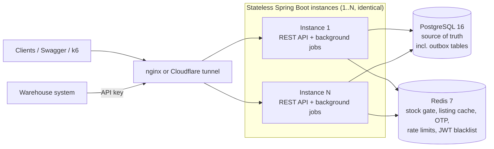
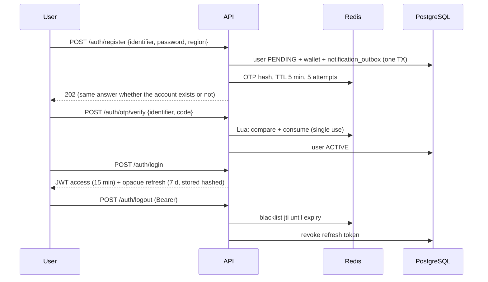
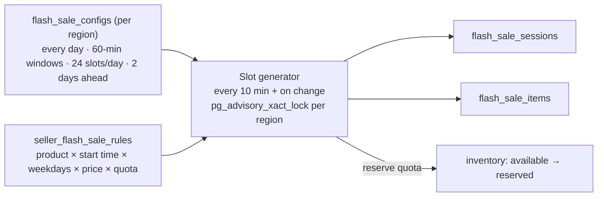
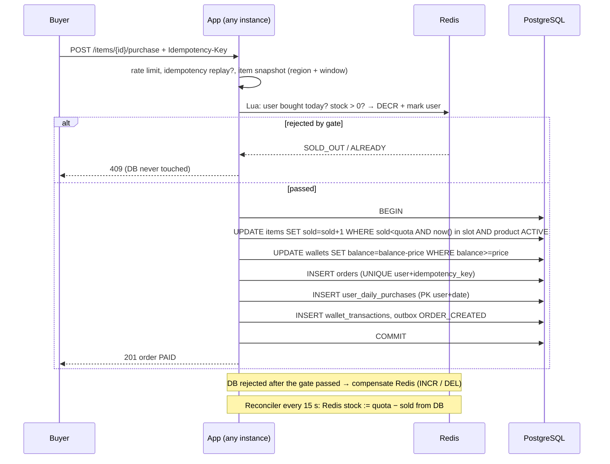
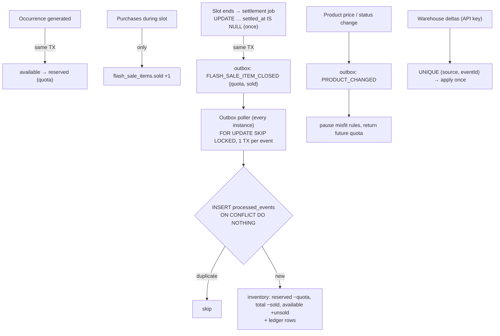
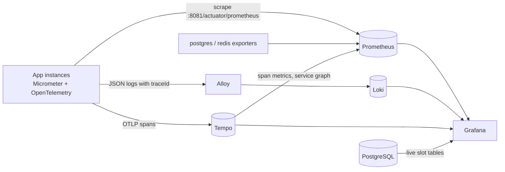
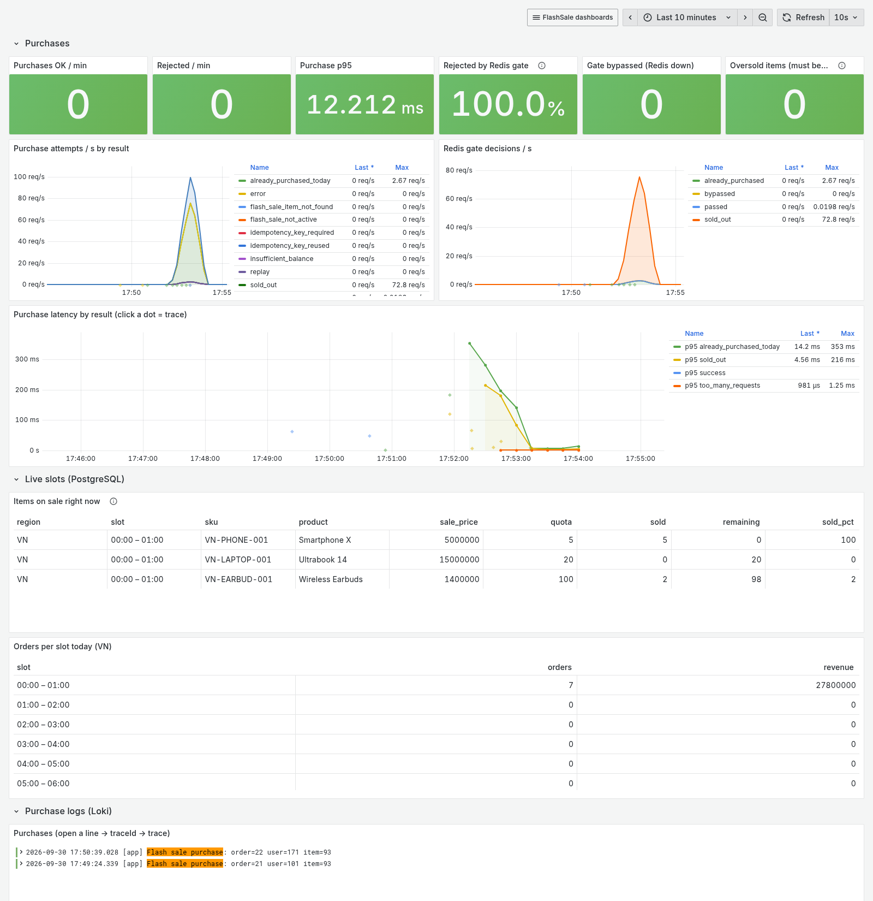

# FlashSale Service — Solution Walkthrough

> Presentation notes for the review: overall architecture · how concurrency is handled · how flash-sale quantity is
> guaranteed · how the system scales in the future. Diagrams render on GitHub (Mermaid).

**Agenda**
1. Goals & constraints
2. Architecture
3. Authentication & security
4. Flash-sale configuration
5. Purchase flow — concurrency
6. How the quantity is guaranteed
7. Inventory sync
8. Observability
9. Multi-instance & performance
10. Future scaling & extensibility
11. Trade-offs & known limitations
12. Live demo script

---

## 1. Goals & constraints

| Requirement | What it means for the design |
|---|---|
| Never sell more than the configured quantity | The database must be the final judge, not application memory |
| 1 flash-sale product per user per day | "Day" must be well defined → region-local day of the slot |
| Correct under concurrent requests | Atomic, constraint-backed writes; idempotent retries |
| ≥ 500 TPS | Losing requests must be rejected cheaply (before the DB) |
| Multi-instance, no local state | Shared state only in PostgreSQL / Redis; locks that work across instances |
| Config in DB, extensible | Schedule, rules, slots, quotas are rows; modules with clear seams |

**Guiding principle:** *PostgreSQL is the source of truth, enforced by constraints; Redis only sheds load.*
Every guarantee still holds if Redis is down: the purchase path falls back to the database, and Redis-backed checks
(rate limiting, logout blacklist) fail open.

---

## 2. Architecture

Source: [images/generate_system_design.py](images/generate_system_design.py) (regenerate the SVG after edits). Simplified view:

Background jobs run on every instance and coordinate through the database: slot generator, slot settlement,
outbox poller, Redis stock reconciler, notification dispatcher.

**Modular monolith** — one deployable, modules with the same internal layering
(`controller / dto / entity / repository / service / service.impl`), ready to be split along these lines:

| Module | Responsibility |
|---|---|
| `auth`, `user`, `notification` | register / OTP / login / logout, wallets, mocked delivery via outbox |
| `catalog`, `inventory` | products, stock buckets + ledger, warehouse sync, audit |
| `flashsale`, `order` | schedule config, seller rules, slot generator, listing, purchase, settlement |
| `outbox` | transactional outbox, poller, dispatcher (Kafka seam) |
| `region`, `common`, `config`, `seed` | market metadata, errors / rate limiting / security, demo data |

**Key technology choices**

| Choice | Why |
|---|---|
| Spring MVC + virtual threads (Java 25) | Simple blocking code, thousands of concurrent requests; no pinning on Java 25 |
| PostgreSQL constraints + conditional UPDATEs | Correctness enforced where the data lives, independent of instance count |
| Redis Lua | Atomic multi-key check-and-decrement to reject losers in ~1 ms |
| Transactional outbox + DB poller | Reliable events without dual writes; Kafka can replace the transport later ([ADR](adr-001-mvc-outbox-kafka.md)) |
| Flyway, Testcontainers, Docker Compose, k6 | Reproducible schema, real-infra tests, one-command setup, measurable performance |
| Micrometer + OpenTelemetry → Prometheus · Loki · Tempo · Grafana | Metrics, logs and traces correlated by `traceId`; dashboards and alerts as code (§8) |

---

## 3. Authentication & security

- One endpoint per function; **email vs phone detected from the input**, phones normalised to E.164.
- **No enumeration:** register/resend always 202; login failure identical (and same BCrypt time) for unknown user
  and wrong password.
- **No sensitive leaks:** passwords BCrypt; OTP stored as HMAC; refresh tokens stored as SHA-256; PII masked in logs
  and responses; DTO `toString()` redacts secrets; errors never echo input; Postgres error details kept out of logs.
- **Abuse protection:** Redis rate limits per IP and per (hashed) identifier; refresh-token reuse → all sessions revoked.
- **Authorization:** roles `USER` (buyer), `SELLER`, `PLATFORM_ADMIN`; warehouse integration uses an API key.

---

## 4. Flash-sale configuration (everything in the database)

- **Platform admin** owns the schedule of their region (windows, weekdays, horizon).
- **Sellers** schedule **their own products**: "Headphones at 12:00 on Mon/Wed/Fri, 2.5M, 20 per slot".
  Validation: own product (composite FK), start time on the window grid, sale price < list price.
- The generator is idempotent (unique slot per region/start, unique product per slot) and never touches a slot that
  has started. Rule change / pause → future occurrences removed, stock returned, regenerated.
- Buyers see all sellers' items merged per slot (`GET /flash-sales/current`); admins see them grouped by seller.

---

## 5. Purchase flow — how concurrency is handled

**Two layers:**
1. **Redis gate** — atomic Lua on `fs:{VN}:stock:{item}` + `fs:{VN}:user:{uid}:{date}` (same hash slot for
   Redis Cluster). Rejects ~all losers in ~1 ms, so the DB only sees roughly `quota` requests per item.
2. **Database transaction** — the only thing that decides success. Row locks serialize buyers of the same item;
   lock order is always *item row → wallet row*, so no deadlocks. The DB clock (`now()`) decides the slot window —
   no clock skew between instances.

---

## 6. How the quantity is guaranteed

| Rule | Enforced by (database) |
|---|---|
| Never oversell | `UPDATE … WHERE sold < quota` (atomic) + `CHECK (sold <= quota)` |
| Buy only inside the slot | `now() >= start_at AND now() < end_at` inside the same UPDATE |
| 1 product per user per day | `PRIMARY KEY (user_id, purchase_date)` |
| No double charge on retry | `UNIQUE (user_id, idempotency_key)` → replay returns the original order |
| No negative balance | `UPDATE … WHERE balance >= amount` + `CHECK (balance >= 0)` |
| Buyer, item, product in one market | composite FKs `(id, region)` |
| Quota exists in stock | quota reserved from inventory before the slot; `CHECK (available + reserved = total)` |

**Failure scenarios**

| Scenario | Outcome |
|---|---|
| 1,000 buyers, last unit | One UPDATE wins the row lock with `sold < quota`; the rest get 0 rows → `SOLD_OUT` |
| Same user, two tabs / two items | Redis user key; if both reach the DB, the PK on `user_daily_purchases` rejects the second |
| Client retries after timeout | Same `Idempotency-Key` → 200 with the original order, no second charge |
| Instance dies after Redis gate, before commit | DB rolled back → nothing sold; reconciler restores Redis stock within 15 s |
| Redis unavailable | Gate bypassed → DB constraints alone keep correctness; rate limiter + logout blacklist fail open; OTP calls → 503. Verified: listing, login, purchase (201) and the daily-limit rejection all work with Redis stopped; "Redis degraded" alert fires |
| Purchase at the exact slot end | Settlement takes the same row lock → counts the committed sale, exactly once |

**Evidence (k6):** 200 concurrent buyers on a quota-5 item → `sold = 5`, exactly 5 orders, no user with two
purchases on a day, total debits = order totals — on 1 instance and on 2 instances behind nginx.

---

## 7. Inventory sync

**Business rule (Shopee-style):** flash-sale stock is **committed before** the slot, **frozen** while it runs,
**settled once** when it ends.

- **No duplicate processing:** at-least-once delivery, exactly-once effect — `processed_events (consumer, event_id)`
  in the same transaction as the effect; ledger `ref_event_id` UNIQUE; warehouse `(source, eventId)` UNIQUE;
  restock `(product, Idempotency-Key)` UNIQUE; settlement guarded by `settled_at IS NULL`.
- **Consistency:** commutative deltas (delivery order irrelevant), conditional UPDATEs, `CHECK (available + reserved
  = total)`, audit endpoint comparing stock with ledger sums, dead-letter queue + retry for failures.
- **Why not update inventory per purchase:** 1 event per item per slot instead of per sale, and no second hot row
  in the purchase transaction. Trade-off: `total` lags by at most one slot (1 h); live sold count is exact.

---

## 8. Observability

**Three signals, correlated.** Every request gets a `traceId`; it appears in the JSON log lines, in the trace, and as an
exemplar on latency histograms — so any spike can be followed down to the exact SQL statement.

| Dashboard | Answers |
|---|---|
| Service overview | Is it up? Traffic, 5xx rate, p50/p95/p99 per endpoint, DB pool, JVM, recent errors |
| Flash sale live | Purchases/s by result, **% rejected by the Redis gate**, purchase latency, items on sale now (sold vs quota), oversold = 0 |
| Inventory, outbox & auth | Outbox backlog / lag / dead letters, **inventory drift = 0**, generator & settlement, warehouse sync, logins / OTP / rate limits |
| Infrastructure | PostgreSQL (TPS, locks, deadlocks), Redis (ops, memory), log volume per container |

More: [service overview](images/grafana-1-overview.png) · [inventory, outbox & auth](images/grafana-3-inventory-outbox.png) ·
[infrastructure](images/grafana-4-infrastructure.png)

**Alerts:** 5xx > 5 %, p95 > 500 ms, outbox lag > 60 s, dead letters, inventory drift > 0, Redis gate bypassed
(DB-only fallback), DB pool saturated, instance down.

**Found by testing the alerts:** stopping Redis first returned 500 on login and purchase (rate limiter and JWT blacklist
threw). Now they fail open, the Lettuce client rejects commands immediately while disconnected (no multi-second
stalls), and remaining Redis-only calls answer 503 + `Retry-After`.

**Found with tracing:** the purchase trace showed an extra `SELECT` before inserting `user_daily_purchases`
(JPA merge on an assigned composite key); making the entity insert-only cut a purchase from 10 to 9 SQL statements.

**Safety:** metrics only on the internal management port; SQL spans record statement text, never bind values; metric
tags are low-cardinality enums (no user ids / emails).

## 9. Multi-instance & performance

**Nothing lives in instance memory:**

| Concern | Mechanism |
|---|---|
| Sessions | Stateless JWT; logout blacklist in Redis |
| OTP, rate limits, stock gate, listing cache | Redis (shared) |
| Outbox / notification workers | `FOR UPDATE SKIP LOCKED` — all instances drain in parallel |
| Slot generator | `pg_advisory_xact_lock` per region + unique constraints |
| Reconciler, seeder | ShedLock (one instance at a time) |
| Settlement | `UPDATE … WHERE settled_at IS NULL` — first instance wins |
| Clock | DB `now()` for slot windows |

**Measured** (k6, single laptop, Docker): mixed 500 req/s for 30 s (80 % listing, 20 % purchase) → **0 errors,
p95 ≈ 2–5 ms**; burst of 200 simultaneous purchases → correct results in ~0.3 s.
Reproduce: `RATE_LIMIT_LOGIN_IP=100000 docker compose --profile loadtest run --rm k6`.

Why it is fast: losers are rejected in Redis; the listing is cached per region for 2 s; the purchase transaction is
~6 short statements on indexed rows; virtual threads keep the connection pool (not threads) as the only limit.

---

## 10. Future scaling & extensibility

| Step | When | How (seams already in place) |
|---|---|---|
| Kafka for events | more consumers (fulfilment, notifications, analytics) | implement `OutboxDispatcher`; `region` is the partition key |
| Scale reads | listing traffic grows | CDN / edge cache of `GET current` (already 2 s TTL), read replicas |
| Scale writes by market | one DB becomes the bottleneck | `region` on every table → LIST partitioning, then DB-per-region; Redis keys already hash-tagged by region |
| Extreme spikes | millions at slot start | waiting room / token queue in front of purchase; pre-warmed Redis stock (reconciler horizon) |
| Split services | team / deploy independence | module boundaries: auth, catalog + inventory, flash sale + order |
| Business | new rules | review flow (`PENDING` items exist), shop flash sales (`type = SHOP` in schema), per-user limits, payments, refunds |

Adding a product, an API or a flash-sale condition is local to one module: e.g. a new purchase condition is one more
check in `PurchaseServiceImpl` / the claim query; a new event consumer is one `EventHandler` bean.

---

## 11. Trade-offs & known limitations

- Inventory `total` lags flash-sale sales by at most one slot (by design; see §7).
- If an instance dies between the Redis gate and the DB commit, that buyer's "bought today" key stays set →
  a rare false `ALREADY_PURCHASED_TODAY` until the day ends. Never oversells; may under-serve one user.
- Nominations are auto-approved; the review API is not built yet.
- Automated tests cover auth / rate limiting / outbox; flash-sale concurrency is proven with k6 rather than JUnit.
- Redis outage = availability over strictness: rate limiting and the logout blacklist fail open (a token logged out
  during the outage stays valid ≤ 15 min); registration / OTP verification return 503 until Redis is back.
- Demo defaults (secrets, OTP visible in logs/Redis) are for local use only.

---

## 12. Live demo script (~5 min)

1. `docker compose up -d --build` → open Swagger (`/swagger-ui.html`).
2. **Auth:** register an email → OTP from `docker compose logs app | grep MOCK` → verify → login → Authorize →
   `GET /users/me` → logout → same token now 401.
3. **Config:** as `admin.vn@flashsale.dev`, `GET /admin/flash-sales/config` (24 × 1 h) and
   `GET /admin/flash-sales/sessions` (items grouped by seller).
4. **Seller:** as `seller.vn@flashsale.dev`, create a product, add a rule (`21:00`, a weekday, price, quota) →
   `GET /seller/flash-sales/items?date=…` shows the generated occurrence; stock moved `available → reserved`.
5. **Buyer:** `GET /flash-sales/current?region=VN` → buy an item → buy again → `409 ALREADY_PURCHASED_TODAY`;
   same `Idempotency-Key` → `200` replay.
6. **Concurrency:** run k6 → exactly `quota` sales; show `sold`, orders and `GET /admin/inventory/audit`
   (`allConsistent: true`).
7. **Observability:** Grafana → *Flash sale live* during the k6 run (results, gate %), click a latency dot → trace
   with every SQL statement → "logs for this span".
8. **Multi-instance (optional):** `--profile scale`, rerun k6 through nginx → same invariants.
