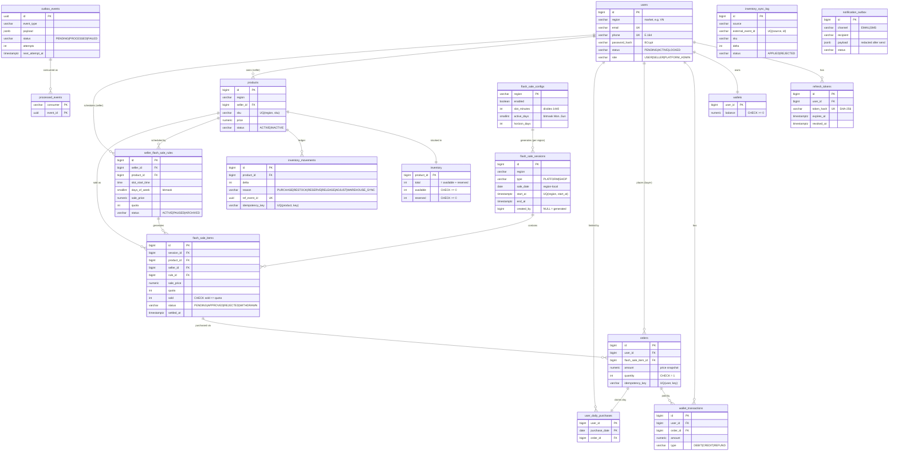

# 1. Requirement 
## High level
- User authentication 
- Flash sale
## Priorities
- Security 
- Fault tolerance 
- Stable in multi instances: race condition, concurrency
- Scalability
## Functional Requirement
- Authentication 
	- Register / log in / log out
	- Flash-sale
	- Sync-store - inventory

## Non-functional requirement 
- Security 
- Performance 
- Scalability
- Extensibility

# 2. Data Model
> Store: PostgreSQL = source of truth. Redis = shared accelerator only (Lua stock gate, listing cache, OTP, rate limits,
> access-token blacklist).
> Timestamps stored in UTC (`timestamptz`). "1 day" = local date of the **region (market)** the flash sale runs in — see 2.0.
> Money = `numeric(19,2)`, currency implied by region.
> **No `regions` table** — `region` is a column on every business table; region metadata (timezone, currency) comes from
> app config — see 2.0.1. Schema source of truth: `src/main/resources/db/migration/V1…V5`.

## 2.0 Decision: timezone / "1 day" = region timezone (Option C)

| Option | "1 day" means | Verdict |
|---|---|---|
| A. Global UTC | UTC date | ❌ VN day resets at 07:00 — bad UX |
| B. Per-user timezone | Local date of each user | ❌ Abusable: user switches tz → extra purchase; inconsistent day boundaries |
| **C. Region/market timezone** | Local date of the region the sale runs in | ✅ Chosen |

Rules:
1. All timestamps stored in UTC (`timestamptz`); `start_at`/`end_at` are absolute instants.
2. Timezone resolved server-side from the row's `region` via region config — never from client header/body/device.
3. `purchase_date` = `flash_sale_sessions.sale_date` (session's local date in region tz, derived on save) — not `now()`. Deterministic; a session crossing midnight (23:00→01:00) counts as its start date.
4. User belongs to exactly one region (set at register; change via platform admin only).
5. **Single source of timezone = region config.** No timezone column in any table. Any local time needed (business rule or display) = `row.region → config → timezone`. API returns ISO-8601 UTC + `region`; client renders local.
6. Purchase requires `user.region = flash_sale_item.region` — enforced by composite FK (see 2.0.2).
7. Future multi-market buying → change `user_daily_purchases` PK to `(user_id, region, purchase_date)`.

### 2.0.1 Region as a column (no `regions` table)

- Every business table has `region varchar(8) NOT NULL` — market code, e.g. `VN`, `TH`. `CHECK (region ~ '^[A-Z]{2,8}$')`.
- Region metadata lives in **app config** (`application.yml`, env-overridable), loaded at startup into `RegionService`; request/data with unknown region → rejected.
  ```yaml
  app:
    regions:
      VN: { timezone: Asia/Ho_Chi_Minh, currency: VND }
      TH: { timezone: Asia/Bangkok,     currency: THB }
  ```
- Flash-sale config (sessions, items, quotas, prices) **still lives in DB** (assignment §2.2); only static market metadata is in config.

| Pros | Cons / mitigation |
|---|---|
| No join to know a row's market; every row self-describing | No FK validates the code → `CHECK` format + `RegionService` validation on write |
| `WHERE region = ?` on every query; indexes lead with `region` | Adding a market / changing tz = config change + redeploy (rare) |
| Natural **partition / shard key** later (Postgres LIST partitioning, DB-per-region) | Column repeated on every table (tiny: 2–8 bytes) |
| Natural **Kafka partition key** / routing key for outbox events | Must keep parent/child region consistent → composite FKs (2.0.2) |

### 2.0.2 Region consistency via composite FKs

Parent tables expose `UNIQUE (id, region)`; children reference `(parent_id, region)`. The DB then guarantees related rows share one region:

```sql
ALTER TABLE users               ADD CONSTRAINT uq_users_id_region    UNIQUE (id, region);
ALTER TABLE products            ADD CONSTRAINT fk_product_seller
      FOREIGN KEY (seller_id, region)  REFERENCES users (id, region);
ALTER TABLE products            ADD CONSTRAINT uq_products_id_seller_region UNIQUE (id, seller_id, region);
ALTER TABLE flash_sale_items    ADD CONSTRAINT fk_item_product_owner       -- seller can only nominate OWN product
      FOREIGN KEY (product_id, seller_id, region) REFERENCES products (id, seller_id, region);
ALTER TABLE flash_sale_items    ADD CONSTRAINT fk_item_session
      FOREIGN KEY (session_id, region) REFERENCES flash_sale_sessions (id, region);
ALTER TABLE orders              ADD CONSTRAINT fk_order_user
      FOREIGN KEY (user_id, region)    REFERENCES users (id, region);
ALTER TABLE orders              ADD CONSTRAINT fk_order_item
      FOREIGN KEY (flash_sale_item_id, region) REFERENCES flash_sale_items (id, region);
-- → an order can only exist if buyer.region = item.region = session.region = product.region = seller.region
```

### 2.0.3 Roles & ownership (Shopee-style marketplace)

| Role | Who | Can do |
|---|---|---|
| `USER` | Buyer | Browse current flash sale of own region, purchase |
| `SELLER` | Shop owner | Manage **own** products + stock; schedule **own** products into flash-sale windows with recurring rules; withdraw single occurrences before they start |
| `PLATFORM_ADMIN` | Platform operator | Manage the flash-sale schedule of own region; view all slots with items grouped by seller; inventory audit; outbox dead letters |

All three are rows in `users` (`role` column, no separate tables); every user has a `region`. **One role per account** — a seller or platform admin cannot purchase (purchase API requires `ROLE_USER`).

**Ownership rules**
- Product belongs to exactly one seller: `products.seller_id`. Product region = seller region → composite FK `(seller_id, region) → users(id, region)`.
- **Owner-only edits**: seller can update only products where `seller_id = current user` (app layer, 403 otherwise). No sharing between sellers of the same region.
- Flash-sale item belongs to the seller who nominated it: `flash_sale_items.seller_id`. Composite FK `(product_id, seller_id, region) → products(id, seller_id, region)` ⇒ **DB guarantees a seller can only put their own product** in a flash sale.
- Region chain: `seller.region = product.region = inventory.region = item.region = session.region = order.region = buyer.region`.
- Role checks (`seller_id` really is a `SELLER`) = app layer (service + `ROLE_*`). Optional DB hardening via `UNIQUE (id, region, role)` + role column in FK — skipped (extra columns, blocks role changes).

### 2.0.4 Flash sale types & flow

| Type | Slots come from | Items from | Shown | Status |
|---|---|---|---|---|
| **`PLATFORM`** (Shopee Flash Sale) | **Region schedule** in `flash_sale_configs` (generated) | Sellers' recurring rules (own products) | Flash-sale page of the region, all sellers merged | ✅ Built |
| `SHOP` (Shop Flash Sale) | Seller | That seller only | Seller's shop page | 🔜 Schema-ready (`type`, `seller_id` on sessions), no API |

Flow (type `PLATFORM`):
1. Platform admin sets the region schedule — default **every day, 60-minute windows → 24 slots/day**, 2 days ahead.
2. Seller creates a rule: *own product × slot start time (`12:00`) × weekdays × sale price × quota per slot*.
3. The generator creates the slots and one item per matching rule, reserving each occurrence's quota from stock
   (`available → reserved`); nominations are auto-approved (`app.flash-sale.auto-approve=true`).
4. Buyer lists the live slot → `APPROVED` items of the region, all sellers merged; buys within the window.
5. When the slot ends, inventory is settled once (sold leave the stock, unsold return to sellable) — see 2.10.

Approval flow later = set the flag `false` → items start `PENDING`; `reviewed_by`, `reviewed_at` already exist.
**1 flash-sale product / buyer / day** is platform-wide (all sellers, all slots of the region-local day).

## 2.1 ERD (Mermaid)



Every table except `processed_events` and `shedlock` also has `region varchar(8)` (shown only where it matters above), and
every FK between business tables is composite `(fk, region) → parent(id, region)` (2.0.2).

## 2.2 Tables

| Group | Table | Key columns & constraints | Migration |
|---|---|---|---|
| Identity | `users` | `UQ email`, `UQ phone`, `CHECK email OR phone`, `UQ (id, region)`, status / role CHECKs | V2 |
| | `refresh_tokens` | `UQ token_hash` (SHA-256 of the opaque token), `revoked_at` | V2 |
| | `wallets` / `wallet_transactions` | `CHECK balance >= 0`; ledger DEBIT / CREDIT / REFUND | V2 |
| | `notification_outbox` | mocked OTP delivery; payload redacted after send; `SKIP LOCKED` dispatcher | V2 |
| Catalog & inventory | `products` | `UQ (region, sku)`, `UQ (id, seller_id, region)`, FK `(seller_id, region) → users` | V2 |
| | `inventory` | `CHECK available >= 0`, `CHECK reserved >= 0`, **`CHECK available + reserved = total`** | V2, V5 |
| | `inventory_movements` | ledger; `UQ ref_event_id` (event applied once); `UQ (product_id, idempotency_key)` (restock once) | V2, V5 |
| | `inventory_sync_log` | warehouse events: `UQ (source, external_event_id)`; outcome APPLIED / REJECTED stored for replays | V5 |
| Flash sale | `flash_sale_configs` | per-region schedule; `CHECK 1440 % slot_minutes = 0`; seeded VN / TH / SG (every day, 60 min, 2 days) | V4 |
| | `seller_flash_sale_rules` | FK `(product_id, seller_id, region) → products` (own product only); `UQ (product_id, slot_start_time)` for live rules | V4 |
| | `flash_sale_sessions` | `UQ (region, start_at)` for PLATFORM slots; `CHECK end_at > start_at`; `CHECK type/seller_id` | V2, V3, V4 |
| | `flash_sale_items` | `UQ (session_id, product_id)`, **`CHECK sold <= quota`**, FK to own product, `rule_id`, `settled_at` | V2, V4, V5 |
| | `orders` | `UQ (user_id, idempotency_key)`, `CHECK quantity = 1`, composite FKs to buyer / item / product | V2 |
| | `user_daily_purchases` | **`PK (user_id, purchase_date)`** — 1 flash-sale product per user per region-local day | V2 |
| Messaging | `outbox_events` | `status`, `attempts`, `next_attempt_at` (backoff), `last_error`; partial index on due PENDING rows | V2, V5 |
| | `processed_events` | `PK (consumer, event_id)` — consumer-side dedupe | V2 |
| | `shedlock` | ShedLock job locks | V1 |

## 2.3 Correctness guaranteed at DB level

| Rule | Enforced by |
|---|---|
| No oversell | `UPDATE flash_sale_items SET sold = sold + 1 WHERE … sold < quota AND now() in slot AND product ACTIVE` + `CHECK (sold <= quota)` |
| 1 product / user / day | `PK (user_id, purchase_date)`; `purchase_date` = slot's region-local `sale_date` |
| Buy only in own market | composite FKs `orders (user_id, region)` + `orders (flash_sale_item_id, region)` |
| Seller schedules only own product | composite FK `(product_id, seller_id, region) → products (id, seller_id, region)` on rules and items |
| No negative balance | `UPDATE wallets … WHERE balance >= ?` + `CHECK (balance >= 0)` |
| No double purchase on retry | `UNIQUE (user_id, idempotency_key)` → replay returns the original order |
| Quota backed by stock | occurrence generation moves quota `available → reserved` in the same TX (skipped if not enough stock) |
| Stock buckets consistent | `CHECK (available + reserved = total)`, each `>= 0` |
| Events applied once | `processed_events` PK + `inventory_movements.ref_event_id` UNIQUE; settlement guarded by `settled_at IS NULL` |
| Warehouse / restock applied once | `UNIQUE (source, external_event_id)`; `UNIQUE (product_id, idempotency_key)` |

Redis (Lua stock gate + per-user-day key) is a pre-filter for throughput only; the database has the final say.

## 2.4 Redis keys (not tables)

| Key | Value | TTL | If Redis is down |
|---|---|---|---|
| `fs:{VN}:stock:{itemId}` | remaining quota (Lua gate) | slot end + 1 h | gate bypassed → DB-only path |
| `fs:{VN}:user:{uid}:{saleDate}` | item bought today | end of region day + 1 h | DB PK still enforces |
| `fs:{VN}:current` | cached listing JSON | 2 s | read from DB |
| `otp:register:{id}` · `otp:cooldown:register:{id}` | `{code, attempts}` (HMAC; plain only with dev flag `OTP_PLAIN_STORAGE`) · flag | 5 min · 60 s | register / verify → 503 |
| `ratelimit:{scope}:{key}` | fixed-window counter (INCR + PEXPIRE in Lua) | window | **fail open** |
| `jwt:blacklist:{jti}` | logged-out access token | until token expiry | **fail open** (≤ 15 min exposure) |

`{VN}` = Redis Cluster hash tag: all keys of one market live in the same slot, so the Lua script can touch them atomically.
`{id}` is an HMAC of the email / phone (no raw PII in Redis) unless `OTP_PLAIN_STORAGE=true` (dev).

## 2.5 Decision log

| # | Question | Decision |
|---|---|---|
| 1 | What is "1 day"? | Region-local day of the slot (2.0) |
| 2 | Quantity per purchase | Always 1 (`CHECK quantity = 1`) |
| 3 | Slot model | One row per slot per day, **generated** from a per-region schedule (default 24 × 1 h) |
| 4 | Reserve quota upfront or on purchase? | Upfront, when the occurrence is generated |
| 5 | `regions` table? | No — `region` column everywhere, metadata in config (2.0.1) |
| 6 | Product ownership | Product → seller → region; owner-only edits; deactivate instead of delete |
| 7 | Who owns slots / items | Platform schedule (config) + seller recurring rules (product × time × weekdays), auto-approve |
| 8 | One account buyer and seller? | No — one role per account |
| 9 | Inventory during a flash sale | Frozen; settled once at slot end (sold leave, unsold return) — 2.10 |
| 10 | Event transport | Transactional outbox + DB poller, `OutboxDispatcher` seam for Kafka ([ADR-001](adr-001-mvc-outbox-kafka.md)) |
| 11 | Warehouse sync | Delta events with idempotency per `(source, eventId)`, never absolute snapshots |
| 12 | Redis outage | Availability first: gate bypassed, rate limiter + logout blacklist fail open, OTP calls 503 (2.12) |
| 13 | Observability | Full stack: Prometheus + Grafana + Loki + Tempo, provisioned as code (2.11) |

## 2.6 Requirement coverage

| Requirement | Covered by |
|---|---|
| 2.1 register / login / logout, email + phone, one API each | `/api/v1/auth/*`; email vs phone detected from `identifier` |
| 2.1 OTP (mock via log / DB / outbox) | Redis code + `notification_outbox` + dispatcher logging |
| 2.2 many slots per day, each with products / quota / amount | `flash_sale_configs` → generated `flash_sale_sessions`; `flash_sale_items.quota` / `sale_price` (API `amount`) |
| 2.2 config in DB | configs, seller rules, slots, items — all rows (platform / seller APIs + seeder) |
| 2.2 list products on sale now · buy only in a valid slot | `GET /api/v1/flash-sales/current` · window check inside the atomic `UPDATE` |
| 2.2 no oversell · 1 per user per day · concurrency | `CHECK (sold <= quota)` + conditional UPDATE · `PK (user_id, purchase_date)` · k6: 200 concurrent buyers → exactly quota |
| 2.3 inventory sync, no duplicates, consistent | outbox + `processed_events` + settlement once + `CHECK (available + reserved = total)` + audit |
| 3.x security · 500 TPS · multi-instance · extensibility | see §3 and `docs/PRESENTATION.md` |

## 2.7 Authentication API

One endpoint per function; email vs phone decided from `identifier` (contains `@` → email, else phone in international format `+84…`, stored E.164).

| Method | Path | Auth | Body | Success | Notes |
|---|---|---|---|---|---|
| POST | `/api/v1/auth/register` | public | `{identifier, password, region}` | 202 generic message | Creates `PENDING` buyer + wallet + OTP in one TX. Existing identifier → same 202 (PENDING gets fresh OTP, ACTIVE ignored) |
| POST | `/api/v1/auth/otp/verify` | public | `{identifier, code}` | 200 | Single-use, 5 min TTL, 5 attempts then invalidated → `ACTIVE` |
| POST | `/api/v1/auth/otp/resend` | public | `{identifier}` | 202 generic message | 60 s cooldown per identifier |
| POST | `/api/v1/auth/login` | public | `{identifier, password}` | 200 `{accessToken, tokenType, expiresIn, refreshToken, refreshExpiresIn}` | Unknown user / wrong password → same 401 (+ dummy BCrypt for equal timing). `ACCOUNT_NOT_VERIFIED` only after correct password |
| POST | `/api/v1/auth/refresh` | public | `{refreshToken}` | 200 new pair | Rotation; reuse of a rotated token → all sessions of user revoked |
| POST | `/api/v1/auth/logout` | Bearer | `{refreshToken}` (optional) | 204 | Access token `jti` blacklisted in Redis until expiry; refresh token revoked |
| GET | `/api/v1/users/me` | Bearer | — | 200 masked profile | Demo of authenticated call |

Security measures:
- **Passwords:** BCrypt; 8–72 chars, letter + digit.
- **OTP:** `SecureRandom`; Redis stores only `HMAC(secret, purpose:identifier:code)`, key = HMAC of identifier (no raw PII in Redis); atomic Lua verify (attempt count + single use).
- **Mock delivery:** `notification_outbox` row written in the same TX → dispatcher (`SKIP LOCKED`, multi-instance safe) logs it (recipient masked; content only if `NOTIFICATION_MOCK_LOG_CONTENT=true`, dev) → payload redacted after send.
- **Tokens:** JWT HS256 (shared secret from env → any instance verifies), 15 min, claims `sub, region, role, jti`; opaque refresh token 7 d, stored as SHA-256. Logout blacklist in Redis (fails open during a Redis outage — 2.12).
- **Rate limits (Redis, per IP / hashed identifier):** register, OTP verify/resend, login, refresh → 429 + `Retry-After`.
- **No sensitive leaks:** RFC 7807 errors with stable `code`, no stack traces, validation lists field names only (never values); DTO `toString()` redacts secrets; PII masked in logs and `/me`; pgjdbc `logServerErrorDetail=false` keeps constraint values out of logs; `correlationId` on every response.

## 2.8 Flash sale buyer flow

`GET /api/v1/flash-sales/current` (public; token region wins over `?region=`) — Redis-cached 2 s.
`POST /api/v1/flash-sales/items/{itemId}/purchase` (buyer, `Idempotency-Key`).

```
purchase ──▶ rate limit (per user) ──▶ idempotency lookup (replay?) ──▶ item snapshot (region + window pre-check)
         ──▶ Redis Lua gate  fs:{VN}:user:{uid}:{saleDate} exists? → 409 ALREADY
                              fs:{VN}:stock:{item} <= 0?          → 409 SOLD_OUT
                              else DECR stock + SET user key
         ──▶ DB TX:  UPDATE items SET sold=sold+1 WHERE sold<quota AND now() in window   (row lock, DB clock)
                     UPDATE wallets SET balance=balance-amt WHERE balance>=amt
                     INSERT orders (UNIQUE user+idempotency_key)
                     INSERT user_daily_purchases (PK user+purchase_date)
                     INSERT wallet_transactions + outbox_events(ORDER_CREATED)
         ──▶ DB said no → compensate gate (SOLD_OUT: stock=0 | ALREADY: INCR | else INCR + DEL user key)
reconciler (ShedLock, 15 s): Redis stock := quota - sold for live/upcoming items
Redis down → gate bypassed, DB alone still correct (see 2.12).
```

Measured (k6, laptop): 200 concurrent buyers on quota 5 → exactly 5 orders, on 1 instance and on 2 instances behind
nginx; 500 req/s mixed load (80 % listing / 20 % purchase), 0 errors, p95 ≈ 2–8 ms.

Known limitation: if an instance dies between the Redis gate and the DB commit, that buyer's day key stays set
(false "already purchased" until the region-local day ends); stock is healed by the reconciler. Acceptable
trade-off: never oversells, may rarely under-serve one user.

## 2.9 Flash sale configuration

**Platform schedule** — `flash_sale_configs` (PK region): `enabled`, `slot_minutes` (divides 1440; default 60 → 24 windows),
`active_days` (bitmask Mon..Sun, default all), `horizon_days` (default 2). Seeded by migration V4; platform admin edits it.

**Seller rules** — `seller_flash_sale_rules`: `product_id` (own, composite FK `(product_id, seller_id, region)`),
`slot_start_time` (region-local, must be a window boundary), `days_of_week` (bitmask), `sale_price` (< product price),
`quota` per slot, `status` ACTIVE / PAUSED / ARCHIVED. Unique live rule per `(product, start time)`.

**Generator** (`SlotGenerationService`, every 10 min + on change, `pg_advisory_xact_lock` per region):
```
for day in [today, today + horizon) where config.active(day):
  for window in 0 .. windowsPerDay-1:
    slot exists with same start/end? use it : overlaps another slot? skip : create (created_by NULL = generated)
    if slot already started → no new items
    for each ACTIVE rule matching (weekday, window start):
      item (slot, product) exists? skip : reserve quota from inventory → insert item (rule_id, APPROVED if auto-approve)
      not enough stock → skip occurrence (counted in result)
```
- Rule update / pause / archive → delete its not-yet-started items (no orders possible), release stock, regenerate.
- Seller withdraws one occurrence → item WITHDRAWN (row kept → generator will not recreate it).
- Config change → applies to slots generated from then on; existing slots kept.
- Buyer listing / purchase unchanged — they work on any slot.

## 2.10 Inventory sync (requirement 2.3)

**Business rule:** flash-sale stock is committed **before** the slot (quota reserved `available → reserved` when the
occurrence is generated), frozen while the slot runs (quota immutable, purchases touch only `flash_sale_items.sold`),
and **settled once at slot end**: `reserved −quota`, `total −sold`, `available +unsold`. Same as Shopee campaign stock.

```
purchase TX ──(same TX)──▶ outbox: ORDER_CREATED            (fulfilment/notifications — no inventory effect)
slot ended  ──settlement──▶ outbox: FLASH_SALE_ITEM_CLOSED {quota, sold}   (UPDATE … settled_at IS NULL → once)
product PATCH ────────────▶ outbox: PRODUCT_CHANGED
                                   OutboxPoller (every instance, 500 ms): claim 1 event FOR UPDATE SKIP LOCKED
                                   └▶ OutboxDispatcher (in-process; Kafka later)
                                      per handler: INSERT processed_events ON CONFLICT DO NOTHING → 0 rows = duplicate
                                      effect in the same TX → PROCESSED | error → backoff, FAILED after 10
inventory consumer:  ITEM_CLOSED → one conditional UPDATE (keeps available + reserved = total) + ledger rows
flash-sale consumer: PRODUCT_CHANGED → pause misfit rules, remove future occurrences, release reserved
warehouse API:       delta events, UNIQUE (source, eventId), one TX per event, never touches reserved
```

Why: 1 inventory event per item per slot instead of 1 per sale; inventory frozen during the sale → nothing can race
with it; no oversell because the quota was carved out upfront. Trade-off: `total` lags by at most one slot (1 h);
live sold count is exact in `flash_sale_items.sold` / `orders`.

Cutover: items sold under the earlier per-order model subtract only `sold − units already deducted` (from the ledger).

Invariants: `CHECK (available + reserved = total)`, each `>= 0`; audit endpoint compares stock with ledger sums.


## 2.11 Observability

`docker compose --profile observability up -d` → Grafana on `localhost:3000` (config in `docker/observability/`).

| Signal | Path | Highlights |
|---|---|---|
| Metrics | Micrometer → `/actuator/prometheus` on the **internal management port 8081** → Prometheus (+ postgres / redis exporters) | business metrics: `flashsale_purchase_total{result}`, `flashsale_gate_total{result}`, `outbox_pending_events`, `outbox_lag_seconds`, `inventory_drift_products`, `auth_login_total{result}`, `ratelimit_rejected_total{scope}`, `redis_fail_open_total{component}`, … |
| Logs | JSON (logstash encoder) → Alloy → Loki | `traceId`, `spanId`, `correlationId` as structured metadata; PII masked |
| Traces | Micrometer Tracing → OpenTelemetry OTLP → Tempo | HTTP, security, Redis (Lettuce) and SQL spans (statement text only); exemplars on latency histograms |

Dashboards (provisioned): service overview · flash sale live · inventory, outbox & auth · infrastructure.
Alerts (8): 5xx rate, p95 latency, outbox stuck, dead letters, inventory drift, Redis degraded, DB pool saturated,
instance down.

## 2.12 Resilience: Redis outage (verified by stopping Redis)

| Function | Behaviour while Redis is down |
|---|---|
| Listing | served from the DB (cache miss) |
| Login | works (rate limiter fails open) |
| Purchase | works via the DB-only path; oversell / daily-limit guarantees unchanged (DB constraints) |
| Authenticated calls | logout blacklist fails open → a token logged out during the outage stays valid ≤ 15 min |
| Register / OTP verify | `503 SERVICE_UNAVAILABLE` + `Retry-After: 5` |
| Detection | `redis_fail_open_total` / gate `bypassed` → "Redis degraded" alert |

The Lettuce client rejects commands immediately while disconnected (no multi-second stalls) and reconnects in the
background; the service recovered within ~1 s of Redis returning.

# 3. Tech Stack

> Constraint from the assignment: **Java + Spring Boot**. Everything else was chosen for correctness under concurrency,
> multi-instance safety and "runs with only Docker installed". Versions are the ones in the build.

## 3.1 Core

| Layer | Choice | Why |
|---|---|---|
| Language | **Java 25 (LTS)** | Records, pattern matching, virtual threads without `synchronized` pinning |
| Framework | **Spring Boot 4.1.1** — Web MVC + virtual threads, Validation, Actuator | Simple blocking code, thousands of concurrent requests; no WebFlux needed for 500 TPS |
| Build | Maven (wrapper `./mvnw`), multi-stage Docker build | No local install needed |
| Database | **PostgreSQL 16** (driver 42.7) | Source of truth; CHECK / UNIQUE / PK constraints; `SKIP LOCKED`; advisory locks; `jsonb` |
| DB access | Spring Data JPA (**Hibernate 7.4**) + native / JDBC statements on hot paths | JPA for CRUD; atomic conditional `UPDATE … RETURNING` written explicitly |
| Connection pool | HikariCP 7 | pool 30, 3 s acquire timeout |
| Migrations | **Flyway 12** (V1–V5) | Versioned schema, constraints, seeded schedule config |
| Shared state | **Redis 7** via Spring Data Redis (**Lettuce 7**) | Lua stock gate, listing cache, OTP, rate limits, JWT blacklist; fail-fast when disconnected |
| JSON | Jackson 3 | Spring Boot 4 default |

## 3.2 Security

| Concern | Choice |
|---|---|
| AuthN / AuthZ | **Spring Security 7**, stateless; `ROLE_USER` / `ROLE_SELLER` / `ROLE_PLATFORM_ADMIN`; warehouse API key |
| Access token | JWT **HS256** (OAuth2 resource server, Nimbus), 15 min, `jti` for the logout blacklist; shared secret from env so every instance verifies every token (RS256 / JWKS when other services must verify) |
| Refresh token | Opaque, SHA-256 hash in `refresh_tokens`, rotated on use, reuse → all sessions revoked |
| Passwords | BCrypt |
| OTP | `SecureRandom` 6 digits, HMAC in Redis, TTL + attempts, single use (Lua) |
| Rate limiting | Redis fixed-window counter (Lua), rules in `app.rate-limit.rules`, fail open on Redis outage |
| Phone numbers | libphonenumber 9 → E.164 |
| Data protection | PII masking in logs / responses; secrets redacted in `toString()`; pgjdbc `logServerErrorDetail=false`; SQL spans without bind values; metrics / actuator only on the internal management port |
| Secrets | Env variables (`.env`, git-ignored); `.env.example` with dev-only defaults |

## 3.3 Concurrency / distributed coordination

| Concern | Choice |
|---|---|
| Purchase hot path | Redis Lua gate → one DB transaction (item row → wallet row lock order) |
| Final correctness | Conditional UPDATEs + constraints; DB clock `now()` for slot windows |
| Event delivery | Transactional outbox + poller (`FOR UPDATE SKIP LOCKED`, backoff, dead letter); `OutboxDispatcher` seam for Kafka |
| Dedupe | `processed_events (consumer, event_id)` in the consumer's transaction |
| Slot generator | `pg_advisory_xact_lock` per region + unique constraints |
| Scheduled jobs | ShedLock 7 (reconciler, seeder); settlement guarded by `settled_at IS NULL` |
| Idempotency | `Idempotency-Key` on purchase and restock; warehouse `(source, eventId)` |

## 3.4 API & docs

| Concern | Choice |
|---|---|
| Style | REST + JSON, versioned `/api/v1` |
| Errors | RFC 7807 `ProblemDetail` with stable `code` + `correlationId`; 503 + `Retry-After` for dependency outages |
| Docs | springdoc-openapi 3 → Swagger UI with a try-it guide; Postman collection; step-by-step curl guide |
| Mapping | Small static factories on DTO records (no mapper library needed at this size) |
| Boilerplate | Lombok on entities; records for DTOs |

## 3.5 Observability

| Concern | Choice |
|---|---|
| Metrics | Micrometer 1.17 → Prometheus (+ postgres_exporter, redis_exporter) |
| Logs | Logback JSON (logstash-logback-encoder 9) → Grafana Alloy → Loki |
| Traces | Micrometer Tracing 1.7 + OpenTelemetry 1.62 (OTLP) → Tempo; SQL spans via datasource-micrometer 2.3 |
| Dashboards / alerts | Grafana 12, provisioned as code (4 dashboards, 8 alert rules) |

## 3.6 Testing & quality

| Concern | Choice |
|---|---|
| Unit / integration | JUnit 5, AssertJ, **Testcontainers 2** (real PostgreSQL + Redis) — 34 tests: auth flow, rate limiting, notification outbox |
| API end-to-end | Postman collection run with **Newman** (39 requests, 50 assertions) |
| Load & concurrency | **k6** in Docker: burst of 200 buyers on a quota-5 item + 500 req/s mixed load |
| Coverage | JaCoCo |

## 3.7 Deliberately not used (and why)

| Skipped | Reason |
|---|---|
| Kafka / RabbitMQ | Outbox + poller covers the scope with fewer moving parts; transport seam kept |
| WebFlux | MVC + virtual threads meets the target with simpler code |
| Redisson / distributed locks | Atomic SQL / Lua and unique constraints instead of lease-based locks |
| Bucket4j | A 5-line Lua fixed-window limiter is enough and easier to reason about |
| Microservices | Modular monolith; module boundaries allow a split later |
| External IdP (Keycloak) | The assignment asks to build authentication |

# 4. Docker & local environment

Everything runs with Docker only (`docker-compose.yml`, project `flashsale`). Optional parts are Compose **profiles**.

| Profile | Services | Ports (host) | Purpose |
|---|---|---|---|
| *(default)* | `app`, `postgres`, `redis` | 8080 API · 127.0.0.1:8081 actuator · 5432 · 6379 | The service |
| `scale` | `app-2`, `nginx` | 8088 | Second instance behind a load balancer |
| `loadtest` | `k6` | — | `docker/k6/flash-sale.js` |
| `tools` | `pgadmin`, `redisinsight` | 127.0.0.1:5050 · 127.0.0.1:5540 | DB / Redis web UIs (pre-registered) |
| `observability` | `prometheus`, `grafana`, `loki`, `alloy`, `tempo`, `postgres-exporter`, `redis-exporter` | 127.0.0.1:3000 · 127.0.0.1:9090 | Metrics, logs, traces |
| `tunnel` | `tunnel` (Cloudflare) | public `*.trycloudflare.com` | Share the API (only `app:8080`) |

- **Image:** multi-stage `Dockerfile` (JDK 25 build with the Maven wrapper → JRE 25 alpine runtime, layered jar,
  non-root user); healthcheck on `:8081/actuator/health/readiness`.
- **Startup:** PostgreSQL + Redis healthy → app runs Flyway V1–V5 → seeder (accounts, products, rules; `SEED_ENABLED`)
  → slot generator creates today's and tomorrow's slots → readiness UP.
- **Config:** all via env (`.env`, see `.env.example`): secrets (`JWT_SECRET`, `OTP_SECRET`, `WAREHOUSE_API_KEY`),
  dev flags (`OTP_PLAIN_STORAGE`, `NOTIFICATION_MOCK_LOG_CONTENT`, `SEED_ENABLED`), load-test knobs
  (`RATE_LIMIT_LOGIN_IP`), `TRACING_ENABLED`.
- **Multi-instance:** instances are identical and stateless; Prometheus discovers them by DNS; nginx balances them.
